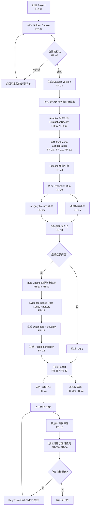
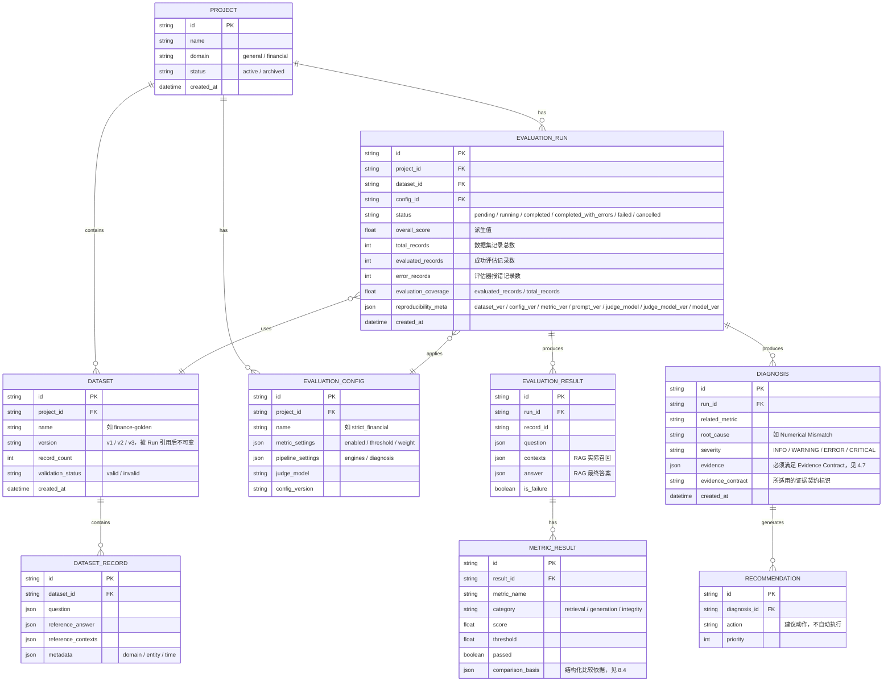

# RAGEval Studio 需求规格说明书（PRD）

> **RAG Quality Evaluation & Diagnosis Platform**

> | 文档名称 | RAGEval Studio 需求规格说明书（PRD）             |
> | ---- | --------------------------------------- |
> | 版本   | v1.3                                    |
> | 作者角色 | 产品经理                                    |
> | 日期   | 2026-08-28                              |
> | 状态   | 评审稿                                     |
> | 上游输入 | 《RAGEval Studio 产品与技术落地设计方案 v1.0》       |
> | 部署形态 | 本地单机运行（Docker Compose **仅 app 容器**）；数据库使用 **Supabase Cloud 托管 PostgreSQL**；MVP 不含多用户与 RBAC |

> **阅读约定**
>
> 1. 本文档只描述「要什么」，不规定「怎么实现」。技术栈（FastAPI / PostgreSQL / RAGAS 等）作为**已定约束**记录在第 10 章，不作为需求项。
> 2. 第 5 章非功能需求按**约束层级**分三层：**Level A** Product Requirement（必须满足，作为验收红线）、**Level B** Engineering Target（开发目标，不作为验收红线）、**Level C** Benchmark Baseline（开发完成后实测确定）。仅 Level A 构成产品基线。
> 3. 需求编号规则：`FR-<两位序号>`，按模块分段；用户故事 `US-<序号>`；成功标准 `SC-<序号>`；待确认问题 `Q<序号>`。
> 4. 指标阈值与权重属于 **Evaluation Profile 配置**，平台不预置任何「行业统一阈值」。文档中出现的数值均为**配置示例**。

---

## 1. 产品目标与价值

### 1.1 背景与要解决的问题

通用 Evaluation / Observability 产品已经较好地解决了以下通用能力：

```text
Dataset             Evaluation          Experiment
Trace               Score               Failure Review
Version Comparison
```

因此，RAGEval Studio **不将「评估」「数据集」「实验」「版本比较」本身定义为核心差异化**——它们是承载质量工程闭环所必需的基础设施，而不是与 Langfuse / Phoenix 正面竞争的卖点。

但针对 **RAG 质量工程**，仍存在进一步专业化的空间：

```text
Metric
  ↓
Failure
  ↓
Diagnosis
  ↓
Evidence
  ↓
Root Cause
  ↓
Recommendation
  ↓
Regression
```

具体而言，团队拿到评估结果后，仍需人工完成从「指标异常」到「可执行修复动作」的整段推理：

| 环节                       | 现状痛点                          |
| ------------------------ | ----------------------------- |
| Metric → Failure         | 指标只给出「异常程度是多少」，不说明失败属于哪一类问题   |
| Failure → Root Cause     | 缺少系统化的证据链，「为什么失败」仍需人工逐条翻上下文推断 |
| Root Cause → Improvement | 结论缺少可追溯的证据支撑，难以沉淀为可复用的修复动作    |
| Improvement → 验证         | 缺少与历史版本的回归对比，无法判断修改是否真的改善     |

在对事实一致性敏感的场景中这一点尤其明显：`Faithfulness = 0` 只说明答案不被上下文支持，无法指出是数值写错、年份错位、主体错配还是单位错误。

因此，RAGEval Studio 的核心价值是：

> **从「评估结果」进一步走向「RAG 失败诊断与质量回归工程」。**

> **RAGEval Studio 的核心不是重新发明 Evaluation，而是将 RAG Evaluation 结果进一步转化为可验证、可追踪的故障诊断。**

> **边界声明**：本产品不主张替代 Langfuse / Phoenix。二者在**在线链路追踪与生产可观测**方面是互补能力，本产品聚焦**离线质量评估与诊断**，不重复建设在线监控。

### 1.2 建设目标

建立统一的 RAG 质量工程平台，跑通完整质量闭环：

```text
Evaluation
      ↓
Failure Detection
      ↓
Diagnosis
      ↓
Evidence
      ↓
Root Cause
      ↓
Recommendation
      ↓
Version Comparison
      ↓
Regression
```

平台必须回答四个问题：

| # | 问题              | 对应能力                                |
| - | --------------- | ----------------------------------- |
| 1 | 我的 RAG 系统表现怎么样？ | Evaluation + Raw Metrics            |
| 2 | 哪个环节出了问题？       | Failure Classification / Diagnosis  |
| 3 | 为什么会出现这个问题？     | Evidence-based Root Cause Diagnosis |
| 4 | 修改之后是否真的变好了？    | Version Comparison + Regression     |

> **Evaluation 负责「发现问题」，Diagnosis 负责「解释问题」，Regression 负责「验证修改是否改善」。**

### 1.3 成功标准（可量化）

| 编号   | 成功标准                                                                              | 类型      |
| ---- | --------------------------------------------------------------------------------- | ------- |
| SC-1 | 给定 100 条黄金数据集，从导入到生成含诊断的完整报告，全流程自动完成，中间无需人工介入                                     | 二元 · 可测 |
| SC-2 | 报告中所有失败样本 100% 可下钻到具体 `EvaluationRecord` 及原始 `question / contexts / answer`       | 覆盖率     |
| SC-3 | 所有低于阈值的 P0 指标 100% 触发诊断结论，且每条结论满足其对应的 **Evidence Contract**（不允许只给分数，也不允许以「至少 1 条证据」笼统判定） | 覆盖率     |
| SC-4 | 同一 Dataset 上任意两个 Run 的对比，100% 指标输出变化量与回归判定                                        | 覆盖率     |
| SC-5 | 1000 条以内数据集单次评估端到端耗时 ≤ 30 分钟                                                      | Level B  |
| SC-6 | 同一输入、同一配置、同一版本环境下的 Run，100% 可追溯其评估口径与主要执行上下文（**不要求** LLM 输出逐字一致）                  | 二元 · 可测 |
| SC-7 | 报告 100% 同时展示 Raw Metrics 与 Composite Score，禁止只展示单一总分                              | 二元 · 可测 |
| SC-8 | Integrity 类错误（数值 / 时间 / 实体不一致）可被独立识别与分类，并按 Evaluation Profile 配置的严重等级呈现，而非混在通用分数里 | 二元 · 可测 |

### 1.4 非目标（MVP 明确不做）

| 非目标                               | 原因                                                                                           |
| --------------------------------- | -------------------------------------------------------------------------------------------- |
| 自动修改用户 RAG 代码 / Chunk / Prompt    | MVP 只提供建议，不自动执行修改                                                                            |
| 自动搜索最佳 Top-K 等超参寻优                | 属于 Auto Optimization，P2                                                                      |
| 完整 Agent Evaluation               | 超出 RAG 质量评估范围                                                                                |
| 在线生产 Observability（实时链路追踪、线上监控告警） | 与 Langfuse / Phoenix 等平台**互补**；本产品聚焦离线质量评估与诊断，不重复建设在线可观测能力                                   |
| 企业级多租户权限体系                        | 与本地单人部署形态不符                                                                                  |
| 大规模分布式计算平台                        | MVP 数据量不需要                                                                                   |
| 其他行业的领域专属指标                       | MVP 只提供通用指标（Retrieval / Generation）+ Integrity Metrics；Integrity Metrics 是通用质量维度，不扩展为行业专属指标集 |

### 1.5 差异化定位（与 Langfuse / Phoenix 的关系）

#### 1.5.1 不作为差异化的能力

以下能力 Langfuse / Phoenix 等平台已具备，本产品实现它们是为了**承载诊断闭环**，不构成差异化主张：

```text
Dataset          Evaluation        Experiment
Trace            Failure Review    Version Comparison
```

#### 1.5.2 核心差异化能力

本产品的差异化集中在**诊断深度与因果可解释性**：

| 维度                                           | 差异化说明                                                                                    |
| -------------------------------------------- | ---------------------------------------------------------------------------------------- |
| Failure Diagnosis（失败诊断）                      | 将**诊断作为一等公民（First-class Capability）**：指标异常必须触发结构化的根因判定，而非停留在分数展示层                        |
| Evidence-based Root Cause Analysis（证据驱动根因分析） | 每条诊断结论必须携带可追溯的证据链（Gold Context / Retrieved Context / Top-K / Metadata 等），**禁止无证据的猜测式归因** |
| Integrity Metrics（一致性指标）                     | 平台提供实体 / 时间 / 数值一致性指标维度，对一致性敏感的场景（如金融）尤为实用；**并非金融专属指标**，是否启用与严重等级由 Evaluation Profile 决定 |
| Recommendation（可执行建议）                        | 输出可落地的修复动作，但**不自动修改用户系统**                                                                |
| Regression（回归判定）                             | 明确回答「修改后是否真的改善」，并识别此消彼长的隐性退化（如检索提升但忠实度下降）                                                |

#### 1.5.3 产品定位

> Langfuse / Phoenix 已经提供成熟的 Observability / Evaluation / Dataset / Experiment 等通用能力。RAGEval Studio 的 MVP **不与其在这些通用能力上进行正面竞争**，而是专注于 **RAG-specific quality diagnosis、evidence-based root cause analysis 和 regression workflow**。

RAGEval Studio 将以下四项作为主要产品差异化方向：

```text
诊断深度                    从「指标异常」推进到「失败分类与根因」
证据链                      每条结论可追溯到具体证据
RAG-specific Failure Taxonomy   面向 RAG 的失败分类体系
检索 / 生成根因定位           明确问题归属 Retrieval 还是 Generation
```

**定位不是**：AI Observability Platform / Langfuse Alternative / Phoenix Alternative / 通用 LLM Evaluation Platform。

> **RAGEval Studio = RAG Quality Evaluation & Diagnosis Platform**

核心产品闭环：

```text
Evaluation
   ↓
Failure Detection
   ↓
Diagnosis
   ↓
Evidence
   ↓
Root Cause
   ↓
Recommendation
   ↓
Version Comparison
   ↓
Regression
```

重点差异化链路：

```text
Metric
   ↓
为什么异常？
   ↓
Evidence
   ↓
Root Cause
```

#### 1.5.4 借鉴原则

业界通用 AI Engineering 平台在以下概念上具备成熟实践，允许在**概念层面**参考借鉴，但**不复制其产品定位**，也不写成竞争性需求：

```text
Dataset      Experiment        Evaluator      Score
Run          Evaluation Config Versioning     Reproducibility
Code Evaluator   LLM-as-Judge   Experiment Comparison
```

RAGEval Studio 自己的核心领域模型保持为：

```text
EvaluationRecord → EvaluationRun → MetricResult → Failure
      ↓
Evidence → Diagnosis → Recommendation → Regression
```

---

## 2. 用户角色与权限矩阵

### 2.1 权限模型说明（重要）

MVP 部署形态为**本地单人开发机**，系统层面**不做登录鉴权**，不存在账号体系。因此本章的「角色」是**用户画像（Persona）**，用途是：

1. 指导 UI 信息架构与页面优先级（哪些信息放首屏、哪些折叠）；
2. 作为功能需求的**归属方**，保证每条需求都有明确服务对象；
3. 为 P2 阶段引入 RBAC 时预留映射关系。

> 系统级权限控制（Multi-user / RBAC / Multi-tenant）为 **P2**，见 FR-45。

### 2.2 角色画像与功能可达范围

| 角色          | 职责描述         | 核心关注                                   | MVP 功能可达范围                                                                                                                                         |
| ----------- | ------------ | -------------------------------------- | -------------------------------------------------------------------------------------------------------------------------------------------------- |
| RAG 开发者     | 构建与调优 RAG 链路 | Retrieval 是否有效、Generation 是否可靠、修改后是否变好 | 创建/编辑 Project（FR-01/02）；导入并校验 Dataset（FR-04/05）；接入 RAG 输出（FR-07）；配置与执行评估（FR-10~~13、FR-19）；查看指标与失败样本（FR-15~~16、FR-21）；查看诊断与建议（FR-23~26）；导出结果（FR-31） |
| AI 应用工程师    | 保障交付质量与工程化   | 版本对比、自动化评估、回归测试、CI/CD                  | 在 RAG 开发者权限基础上：创建/复用评估配置（FR-11）；执行版本对比与回归检测（FR-33/34）；导出 Machine Report 供 CI 消费（FR-30）                                                             |
| 知识库运营人员     | 维护知识库内容质量    | 哪些问题回答失败、哪些知识缺失、哪些数据质量有问题              | **只读**：查看报告、失败案例清单、诊断结论；导出失败清单（FR-31）。不可执行评估或修改配置                                                                                                  |
| 项目负责人       | 把控上线节奏与风险    | 总体质量、版本趋势、风险指标、是否达到上线标准                | **只读 + 阈值设定**：查看 Dashboard（FR-36）、Overall Score 与趋势（FR-28）、版本对比（FR-33）；设定质量门槛 Quality Gate（FR-11）                                                  |
| 本地系统管理员（隐式） | 部署与运维        | 服务可用性、密钥管理                             | 一键启动/停止（FR-40）；配置 Judge LLM 密钥（NFR-安全-01）；无应用层鉴权                                                                                                   |

---

## 3. 用户故事

| 编号    | 用户故事                                                                                       | 映射 FR             |
| ----- | ------------------------------------------------------------------------------------------ | ----------------- |
| US-01 | 作为 **RAG 开发者**，我希望导入 JSON 格式的黄金数据集并在导入时自动校验，以便避免「黄金数据本身错误导致评估结果失真」                         | FR-04、FR-05       |
| US-02 | 作为 **RAG 开发者**，我希望把任意 RAG 框架的输出统一转成标准 EvaluationRecord，以便不被 LangChain / LlamaIndex 等具体框架绑定 | FR-06、FR-07       |
| US-03 | 作为 **RAG 开发者**，我希望通过 Evaluation Profile 配置启用哪些指标、阈值多少、权重多少，以便根据具体任务的风险自行设定质量门槛             | FR-10、FR-11、FR-12 |
| US-04 | 作为 **RAG 开发者**，我希望看到每个指标的原始分数，而不只是一个总分，以便知道到底是哪一项拖了后腿                                      | FR-15~16、FR-28    |
| US-05 | 作为 **RAG 开发者**，我希望点开失败样本看到它的 question、召回 contexts 和实际 answer，以便复现问题现场                      | FR-18、FR-21       |
| US-06 | 作为 **RAG 开发者**，我希望系统告诉我「哪里错了」而不是「分数低」，以便直接定位到检索还是生成环节                                      | FR-23、FR-24、FR-25 |
| US-07 | 作为 **RAG 开发者**，我希望得到可执行的优化建议，而不是系统自动改我的代码，以便我保留最终决策权                                       | FR-26             |
| US-08 | 作为 **RAG 开发者**，我希望数值写错、年份错位、主体错配能被独立识别与分类，以便优先处理会引发合规风险的错误（在金融等一致性敏感场景中尤其关键）               | FR-14、FR-25       |
| US-09 | 作为 **AI 应用工程师**，我希望对比同一数据集上两个版本的评估结果，以便判断这次修改是否真的变好                                        | FR-33、FR-34       |
| US-10 | 作为 **AI 应用工程师**，我希望导出 JSON 格式的机器可读报告，以便接入 CI 做质量门禁                                         | FR-30、FR-31       |
| US-11 | 作为 **AI 应用工程师**，我希望系统自动提示「检索质量提升但生成忠实度下降」这类此消彼长，以便避免局部优化带来整体退化                             | FR-34             |
| US-12 | 作为 **知识库运营人员**，我希望一键导出所有失败问题清单，以便反推哪些知识该补、哪些文档质量差                                          | FR-31             |
| US-13 | 作为 **知识库运营人员**，我希望数据集版本化（v1/v2/v3），以便知道某次评估用的是哪一版黄金数据                                      | FR-03             |
| US-14 | 作为 **项目负责人**，我希望看到质量趋势和是否达到上线门槛，以便决定能否放行发布                                                 | FR-28、FR-36、FR-11 |
| US-15 | 作为 **项目负责人**，我希望任何一次历史评估都能被完整复现，以便结果经得起追溯和审计                                               | FR-13、FR-20       |

---

## 4. 功能需求清单（需求池）

> 优先级：**P0** = 必须（MVP 门槛，100% 覆盖主流程） / **P1** = 重要（第二阶段） / **P2** = 可选（暂不考虑）

### 4.1 项目管理

| 编号    | 模块   | 功能                         | 优先级 | 说明                 |
| ----- | ---- | -------------------------- | --- | ------------------ |
| FR-01 | 项目管理 | 创建 / 编辑 / 归档 Project       | P0  | Project 为所有资源的顶层容器 |
| FR-02 | 项目管理 | Project 下聚合展示数据集、配置、Run 列表 | P0  | 承接 US-01、US-14     |

### 4.2 数据集管理

| 编号    | 模块    | 功能                                       | 优先级 | 说明                                                          |
| ----- | ----- | ---------------------------------------- | --- | ----------------------------------------------------------- |
| FR-03 | 数据集管理 | Dataset 版本化（如 `finance-golden-v1/v2/v3`） | P0  | 版本一经被 Run 引用即不可变更，保证可复现（US-13）                              |
| FR-04 | 数据集管理 | 导入 Golden Dataset（JSON 格式）               | P0  | MVP 唯一导入通道；单数据集 ≤ 1000 条                                    |
| FR-05 | 数据集管理 | 导入时自动校验                                  | P0  | 5 类校验：Schema / 重复检测 / 缺失字段 / 引用有效性 / 领域元数据；校验不通过须给出可定位的错误清单 |
| FR-06 | 数据集管理 | Dataset 预览与记录数统计                         | P0  | 导入前后均可预览                                                    |

### 4.3 接入适配

| 编号    | 模块   | 功能                      | 优先级 | 说明                            |
| ----- | ---- | ----------------------- | --- | ----------------------------- |
| FR-07 | 接入适配 | 标准化 EvaluationRecord 模型 | P0  | 平台核心抽象，字段见 8.2；不得绑定任何 RAG 框架  |
| FR-08 | 接入适配 | JSON Import Adapter     | P0  | 从 JSON 文件转换为 EvaluationRecord |
| FR-09 | 接入适配 | HTTP Adapter            | P1  | RAG 系统以 HTTP 接口对接             |

### 4.4 评估配置

| 编号    | 模块   | 功能                                        | 优先级 | 说明                                                                                                                                                                                  |
| ----- | ---- | ----------------------------------------- | --- | ----------------------------------------------------------------------------------------------------------------------------------------------------------------------------------- |
| FR-10 | 评估配置 | 三层配置体系（System / Domain / Evaluation）      | P0  | 见 10.2 配置目录约定                                                                                                                                                                       |
| FR-11 | 评估配置 | Evaluation Profile：指标启停、阈值、权重、严重等级、质量门槛配置 | P0  | **阈值与权重属于 Evaluation Profile 配置，平台不预置任何「行业统一阈值」**；阈值同时用于质量门禁判定（US-14）                                                                                                               |
| FR-12 | 评估配置 | Pipeline 配置组装（选择引擎 + 是否启用诊断）              | P0  | 通过配置组装，不在业务层写引擎分支                                                                                                                                                                   |
| FR-13 | 评估配置 | Run 可复现元信息记录                              | P0  | 必录 8 项：Dataset Version / Config Version / Metric Version / Prompt Version / Judge Model / Judge Model Version / Model Version / Timestamp。可复现性 = 可追溯评估口径与主要执行上下文，**不要求** LLM 输出逐字一致 |

### 4.5 指标体系

指标按质量维度分为三类：

```text
Retrieval Metrics
- Context Recall
- Context Precision

Generation Metrics
- Faithfulness
- Answer Relevancy

Integrity Metrics
- Entity Consistency
- Temporal Consistency
- Numerical Consistency
```

> **Integrity Metrics 是通用质量维度，在一致性敏感的场景（如金融）尤其重要，但不是金融行业专属指标。** 是否启用、阈值与权重均由 Evaluation Profile 决定，平台不预置行业统一标准。

#### Integrity Metrics 产品要求

**算法原则：Deterministic-first Hybrid Evaluation**

Entity / Temporal / Numerical Consistency 统一采用「确定性优先、必要时 LLM 兜底」的混合判定：

```text
Raw Input
   ↓
Information Extraction
   ↓
Normalization
   ↓
Deterministic Comparison
   ↓
Tolerance / Equivalence
   ↓
LLM fallback（仅必要场景）
   ↓
Metric Result
```

**Entity Consistency**

至少支持：

```text
实体提取 → 实体标准化 → Alias / Canonical Name → 实体比较
```

同一主体可能表现为：

```text
中国平安 / 平安 / Ping An / 中国平安保险（集团）股份有限公司
```

允许通过 **Alias Dictionary / Metadata / Canonical Entity** 完成归一化。
**MVP 不要求建设完整知识图谱。**

**Temporal Consistency**

至少支持：

```text
年份 / 季度 / 财年 / 报告期 / 具体日期
```

能够标准化：

```text
2024年 / FY2024 / 2024年度 / 截至2024年12月31日
```

**避免简单字符串比较。**

**Numerical Consistency**

必须支持：

```text
数字提取 / 单位提取 / 单位归一化 / 必要的货币归一化
精度处理 / 绝对容差 / 相对容差
```

以下应经标准化后再判断：

```text
1000万元 / 1亿元 / 10000000元
```

MVP 至少考虑的单位范围：

```text
元 / 万元 / 百万元 / 亿元 / 万亿元 / % / ‰
```

> 不声称已支持完整金融单位体系；具体的归一化与等价判定规则由 Q4 定义。

| 编号    | 模块   | 功能                                                                                                              | 优先级 | 说明                                                                                                                                                                                                                              |
| ----- | ---- | --------------------------------------------------------------------------------------------------------------- | --- | ------------------------------------------------------------------------------------------------------------------------------------------------------------------------------------------------------------------------------- |
| FR-14 | 指标体系 | Metric Registry（指标注册中心）                                                                                         | P0  | 每个指标含 name / category / engine / description / input_requirements / evaluator / threshold / weight / domain / severity；支持动态注册                                                                                                   |
| FR-15 | 指标体系 | 通用指标（P0）：Retrieval Metrics（Context Recall、Context Precision）+ Generation Metrics（Faithfulness、Answer Relevancy） | P0  | 提供检索与生成两个维度的通用指标能力                                                                                                                                                                                                              |
| FR-16 | 指标体系 | Integrity Metrics（P0）：Entity Consistency、Temporal Consistency、Numerical Consistency                             | P0  | 一致性质量维度；对实体 / 时间 / 数值一致性敏感的场景尤为实用，**非金融专属**；启用与阈值由 Evaluation Profile 决定                                                                                                                                                        |
| FR-17 | 指标体系 | 后续扩展指标（P1 / Future，不纳入 MVP）                                                                                     | P1  | ① **Citation Accuracy**：与 Faithfulness / Attribution 存在明显交叉，且不同产品对 Citation 的定义可能不同，不纳入 MVP；② **Financial Hallucination**：**禁止作为独立基础 Metric**（不计算 Financial Hallucination Score），改由 4.7 Failure Taxonomy 下的 Integrity / Generation 诊断分类承载 |
| FR-18 | 指标体系 | 指标结果持久化                                                                                                         | P0  | 每一条记录的每一个指标结果均须落库，禁止只存聚合值。除 score / passed / threshold 外，Integrity Metrics 还须保存**结构化比较依据**（见 8.4），作为后续 Diagnosis 的 Evidence 来源                                                                                                    |

### 4.6 评估执行

| 编号    | 模块   | 功能                         | 优先级 | 说明                                                                                                                                   |
| ----- | ---- | -------------------------- | --- | ------------------------------------------------------------------------------------------------------------------------------------ |
| FR-19 | 评估执行 | 执行 Evaluation Run          | P0  | MVP 串行执行，提供进度反馈                                                                                                                      |
| FR-20 | 评估执行 | Run 状态管理                   | P0  | 状态：pending / running / completed / completed_with_errors / failed / cancelled；Run 须同时输出 Evaluation Coverage 与 Evaluation Error Count |
| FR-21 | 评估执行 | 失败样本识别与下钻                  | P0  | 可按指标筛选失败样本，查看完整原始输入输出                                                                                                                |
| FR-22 | 评估执行 | 单条错误隔离                     | P0  | 单条记录评估异常不中断整批，记为评估错误并计入 Evaluation Error Count；整体是否判定为 failed 由 **Run 状态与错误类型共同决定**，不设统一的「失败率阈值」                                     |
| FR-41 | 评估执行 | 异步任务队列（Redis + Celery/ARQ） | P1  | MVP 使用 FastAPI BackgroundTasks / asyncio，见 10.2                                                                                      |
| FR-42 | 评估执行 | ARGUS 评估引擎接入               | P1  | 第二阶段，通过统一引擎接口接入                                                                                                                      |

### 4.7 诊断层

> **Diagnosis 是本平台的一等公民（First-class Capability）**。评估、数据集、实验、版本比较均为承载诊断闭环的基础设施（见 1.5），不是差异化本身。

**核心设计原则：Metric ≠ Diagnosis**

```text
Metric          =  发现「是否异常」
Failure         =  定位「哪些样本失败」
Diagnosis       =  解释「异常属于什么问题」
Evidence        =  说明「为什么这样判断」
Recommendation  =  说明「下一步应该做什么」
Regression      =  验证「修改以后是否改善」
```

**本产品最重要的核心链路**：

```text
Metric
  ↓
Failure
  ↓
Diagnosis
  ↓
Evidence
  ↓
Recommendation
  ↓
Regression
```

#### Failure Taxonomy（失败分类体系）

诊断结论必须归入以下分类：

```text
Failure Type
│
├── Retrieval
│   ├── Missing Evidence
│   ├── Ranking Issue
│   ├── Top-K Issue
│   ├── Metadata Filter Issue
│   └── Knowledge Coverage
│
├── Generation
│   ├── Unsupported Claim
│   ├── Partial Answer
│   └── Irrelevant Answer
│
└── Integrity
    ├── Numerical Mismatch
    ├── Temporal Mismatch
    ├── Entity Mismatch
    └── Unit Mismatch
```

> 「Financial Hallucination」**不进入基础 Metrics 一级目录**，也不计算独立的 Financial Hallucination Score；它拆解为上述 Integrity / Generation 分类下的具体失败类型：

```text
Financial Hallucination
├── Numerical Mismatch
├── Entity Mismatch
├── Temporal Mismatch
├── Unit Mismatch
└── Unsupported Claim
```

#### Evidence Contract（证据契约）

> **Evidence Contract：每类 Diagnosis 所必须满足的最小充分证据集合。**

**禁止**使用统一规则代替它：

```text
evidence.length >= 1    ← 不允许
```

**不同 Diagnosis 需要不同的最小充分证据集**：

| Diagnosis             | 最小充分证据                                          |
| --------------------- | ---------------------------------------------- |
| Missing Gold Evidence | reference_contexts + retrieved_contexts        |
| Top-K Insufficient    | reference_contexts + retrieved_contexts + top_k |
| Numerical Mismatch    | reference evidence + answer claim              |
| Temporal Mismatch     | reference evidence + answer claim              |
| Entity Mismatch       | reference evidence + answer claim              |
| Unsupported Claim     | answer claim + retrieved evidence              |
| Metadata Filter Issue | query + filter + retrieval metadata            |
| Chunking Issue        | retrieved chunk + source/chunk metadata        |
| Reranker Issue        | candidate ranking + final ranking              |
| Query Rewrite Issue   | original query + rewritten query + retrieval result |

> 这不是要求 MVP 立即实现全部规则，而是定义 **Evidence 的产品模型与诊断契约**。MVP 首批诊断规则仍控制在约 10～15 条（见 Q5）。

#### 硬约束：禁止仅依据 Metric Score 推断 Root Cause

**错误逻辑**：

```text
Faithfulness = 0.42
   ↓
直接输出 Chunking Problem
```

**正确逻辑**：

```text
Faithfulness = 0.42
   ↓
Failure
   ↓
Collect Evidence
   ↓
Apply Diagnosis Rule
   ↓
Diagnosis
```

| 编号    | 模块  | 功能                                           | 优先级 | 说明                                                                                                                    |
| ----- | --- | -------------------------------------------- | --- | --------------------------------------------------------------------------------------------------------------------- |
| FR-23 | 诊断层 | Rule Engine（失败诊断规则）                          | P0  | 指标低于阈值 → 采集证据 → 匹配诊断规则 → 输出归入 Failure Taxonomy 的根因                                                                |
| FR-24 | 诊断层 | Evidence-based Root Cause Analysis（证据驱动根因分析） | P0  | **每条 Diagnosis 必须满足对应 Evidence Contract 所规定的最小充分证据集**；Evidence 必须可追溯到原始 EvaluationRecord、Reference Context、Retrieved Context、Answer Claim、Query、Metadata 或执行配置。**禁止仅依据 Metric Score 直接推断 Root Cause** |
| FR-25 | 诊断层 | 诊断严重等级                                       | P0  | 枚举：INFO / WARNING / ERROR / CRITICAL；**具体失败类型到等级的映射由 Evaluation Profile 配置**，平台仅提供枚举与默认建议（参见附录 B 配置原则）                |
| FR-26 | 诊断层 | Recommendation 生成                            | P0  | **只提供建议，绝不自动修改用户系统**（如 Top-K 5→10、开启 Hybrid Search、增加 Query Rewrite）                                                  |
| FR-27 | 诊断层 | LLM-assisted Diagnosis                       | P1  | 仅用于规则无法判断的复杂语义场景；数字/日期/实体/单位等优先规则判断                                                                                   |
| FR-43 | 诊断层 | 检索诊断规则（Context Recall 异常）                    | P0  | 检查项：Gold Context 是否存在 / Top-K 是否过小 / Query Rewrite 是否有效 / Chunk Size / Embedding / Reranker / Metadata Filter / 知识库覆盖 |

### 4.8 报告与导出

| 编号    | 模块    | 功能                                 | 优先级 | 说明                                                                                            |
| ----- | ----- | ---------------------------------- | --- | --------------------------------------------------------------------------------------------- |
| FR-28 | 报告与导出 | Human Report                       | P0  | 含：总体质量、指标详情、失败案例、诊断结果、优化建议、版本对比                                                               |
| FR-29 | 报告与导出 | Composite Score 与 Raw Metrics 同屏展示 | P0  | 允许计算总分，但必须同时保留全部原始指标，禁止只展示总分                                                                  |
| FR-30 | 报告与导出 | Machine Report（JSON）               | P0  | 字段至少含 run_id / dataset_version / metrics / diagnosis / recommendations / status，供 CI 与第三方系统消费 |
| FR-31 | 报告与导出 | 结果导出（JSON）                         | P0  | 支持整份报告与失败清单两种导出口径                                                                             |
| FR-32 | 报告与导出 | PDF Report                         | P1  | —                                                                                             |

### 4.9 版本对比与回归

| 编号    | 模块   | 功能                   | 优先级 | 说明                                                    |
| ----- | ---- | -------------------- | --- | ----------------------------------------------------- |
| FR-33 | 版本对比 | 两个 Evaluation Run 对比 | P0  | 逐指标展示 Version A / Version B 数值                        |
| FR-34 | 回归检测 | 指标变化量计算与回归告警         | P0  | 输出变化量（如 Recall ↑7% / Faithfulness ↓4%）并对退化项给出 WARNING |
| FR-35 | 版本对比 | 质量趋势展示               | P1  | 多次 Run 的指标折线趋势                                        |

### 4.10 前端与部署

| 编号    | 模块 | 功能                       | 优先级 | 说明                                                                                  |
| ----- | -- | ------------------------ | --- | ----------------------------------------------------------------------------------- |
| FR-36 | 前端 | Dashboard 页面             | P0  | Projects / Recent Runs / Quality Trend / 失败样本占比（与评估器错误率区分）                          |
| FR-37 | 前端 | Dataset 页面               | P0  | Dataset List / Version / Record Count / Preview / Import / Validation               |
| FR-38 | 前端 | Evaluation 页面与 Detail 页面 | P0  | 发起评估入口 + Overall Score / Metric Cards / Failure Cases / Diagnosis / Recommendations |
| FR-39 | 前端 | Compare 页面               | P0  | Version A / Version B / Metric Comparison / Regression Detection                    |
| FR-40 | 部署 | 容器化一键部署应用            | P0  | Docker Compose 可启动 **RAGEval 应用容器**；数据库使用预配置的 Supabase Cloud PostgreSQL（**不再是 app + db 两个容器**）。见 NFR 部署项 |

### 4.11 平台能力（P1 / P2）

| 编号    | 模块   | 功能                                                    | 优先级 | 说明                       |
| ----- | ---- | ----------------------------------------------------- | --- | ------------------------ |
| FR-44 | 集成   | CI/CD Quality Gate                                    | P1  | 按阈值判定 PASS / FAIL，供流水线阻断 |
| FR-45 | 平台能力 | Multi-user / RBAC / Multi-tenant                      | P2  | MVP 明确不做                 |
| FR-46 | 平台能力 | Auto Optimization / Auto Hyperparameter Search / SaaS | P2  | MVP 明确不做                 |

### 4.12 优先级汇总

| 优先级    | 数量     | 说明                         |
| ------ | ------ | -------------------------- |
| P0     | 36     | 必须 100% 覆盖主流程，缺任一则 MVP 不成立 |
| P1     | 8      | 第二阶段，不阻塞 MVP 发布            |
| P2     | 2      | 暂不考虑，仅登记防止范围蔓延             |
| **合计** | **46** | 编号 FR-01 ~ FR-46           |

---

## 5. 非功能需求（量化）

> **约束层级（Level A / B / C）**
>
> | 层级          | 名称                       | 含义                               |
> | ----------- | ------------------------ | -------------------------------- |
> | **Level A** | Product Requirement（产品要求） | **必须满足**，作为验收红线                  |
> | **Level B** | Engineering Target（工程目标） | 开发期目标值，不代表永久产品 SLA，**不作为验收红线**  |
> | **Level C** | Benchmark Baseline（实测基线） | 无实测依据，需开发完成后通过 Benchmark 统计确定   |
>
> **原则**：
>
> ```text
> Engineering Target  ≠  Product Requirement  ≠  Industry Standard
> ```
>
> 没有实测依据的数值不得被写成正式产品基线或行业标准。
>
> **当前划分参考**：Level A = 功能正确性、安全、可追溯性、Evidence 完整性等；Level B = 延迟、吞吐、评估耗时等；Level C = 最终性能基线、评估稳定性、Judge variance 等（详见 Q1）。

| 类别      | 要求                   | 指标                                                                                 | 约束层级     |
| ------- | -------------------- | ---------------------------------------------------------------------------------- | -------- |
| 性能      | 1000 条以内数据集单次评估端到端耗时 | ≤ 30 min（强依赖 Judge LLM 吞吐）                                                         | Level B |
| 性能      | 报告详情页首屏加载            | P95 ≤ 2s                                                                           | Level B |
| 性能      | 失败样本列表 / 详情查询        | P95 ≤ 500ms                                                                        | Level B |
| 性能      | 两个 Run 版本对比生成        | ≤ 5s                                                                               | Level B |
| 并发      | 同时运行的 Evaluation Run | MVP ≥ 1（串行）；P1 ≥ 3                                                                 | Level B |
| 稳定性     | 单条记录错误隔离             | MVP 应支持单条记录错误隔离，并允许部分结果产出；具体「整体失败」判定策略由 **Run 状态和错误类型共同决定**，不设统一的失败率阈值             | **Level A** |
| 稳定性     | 异常恢复                 | Run 中途失败后支持重试，已完成的记录结果不丢失                                                          | **Level A** |
| 可用性     | SLA                  | 本地开发机场景不设强制 SLA                                                                    | Level B |
| 安全      | Judge LLM API Key 管理 | 通过环境变量注入；**严禁**明文落库、写入报告或打印到日志                                                     | **Level A** |
| 安全      | 数据边界                 | 评估数据本地存储，除 Judge LLM 调用外不外传                                                        | **Level A** |
| 合规 / 审计 | Run 可复现元信息完整率        | 100%（FR-13 全部 8 项字段缺一不可）                                                           | **Level A** |
| 可复现性    | 评估口径与执行上下文可追溯        | 同一输入、同一配置、同一版本环境下 100% 可追溯；**不要求 LLM 输出逐字一致**                                      | **Level A** |
| 可复现性    | 重复执行的分数稳定性           | 固定 Judge、Temperature、Prompt、Metric Version 后 Benchmark 测量稳定性与方差（±0.02 仅作**历史 Engineering Target 参考量级**，**不是产品基线**） | Level C |
| 兼容性     | 浏览器                  | Chrome / Edge 最新两个大版本                                                              | Level B |
| 兼容性     | 屏幕                   | 最小支持 1440×900                                                                      | Level B |
| 可观测性    | 关键阶段日志覆盖率            | 导入 / 评估 / 诊断 / 报告 4 阶段 100% 落日志                                                    | **Level A** |
| 可观测性    | 日志脱敏                 | 日志中不得出现 API Key、完整 contexts 正文                                                     | **Level A** |
| 可扩展性    | 新增指标所需的业务层改动         | 0 处；通过 Metric Registry 注册，业务层禁止出现 `if engine == "ragas"` 式分支（对应设计原则）               | **Level A** |
| 部署      | 应用启动复杂度 | 1 条 Compose 命令启动应用容器；**数据库为外部预置服务，不随 Compose 启动** | Level B |
| 部署      | 数据库可用性 | 应用通过 `DATABASE_URL` 连接 Supabase Cloud PostgreSQL；健康检查须区分「应用可用」与「数据库可用」 | **Level A** |
| 容量      | 单数据集记录数上限            | 1000 条（MVP，来自设计文档验收口径）                                                             | **Level A** |

---

## 6. 核心业务流程图



**流程与需求的对应自检**：图中 20 个功能节点全部可在第 4 章需求池中找到对应 FR 编号；`F → G → I → L → Q → S → X` 构成 US-01 ~ US-11 的主干路径。

---

## 7. 关键页面原型说明

### 7.1 Dashboard（FR-36）

```text
┌──────────────────────────────────────────────────────────────┐
│  RAGEval Studio                            [Project 切换 ▾]  │
├──────────────────────────────────────────────────────────────┤
│  ┌────────────┐ ┌────────────┐ ┌────────────┐ ┌───────────┐  │
│  │ Projects   │ │ Total Runs │ │ Avg Score  │ │ 失败样本  │  │
│  │    3       │ │    27      │ │   87.4     │ │  占比12%  │  │
│  └────────────┘ └────────────┘ └────────────┘ └───────────┘  │
├──────────────────────────────────────────────────────────────┤
│  Quality Trend（折线图 · ECharts）                            │
│  ┌────────────────────────────────────────────────────────┐  │
│  │  90 ┤        ╭──╮                                      │  │
│  │  85 ┤   ╭────╯  ╰───╮                                  │  │
│  │  80 ┤───╯            ╰──                               │  │
│  │     └────────────────────────────────────             │  │
│  │        v1.0   v1.1   v1.2   v1.3                       │  │
│  └────────────────────────────────────────────────────────┘  │
├──────────────────────────────────────────────────────────────┤
│  Recent Runs                                                  │
│  ┌────────────────────────────────────────────────────────┐  │
│  │ Run ID    │ Dataset Ver │ Score │ Status │ Time        │  │
│  │ run-027   │ fin-v3      │ 87.4  │ PASS   │ 08-28 14:20│  │
│  │ run-026   │ fin-v3      │ 82.1  │ FAIL   │ 08-27 19:05│  │
│  └────────────────────────────────────────────────────────┘  │
└──────────────────────────────────────────────────────────────┘
```

### 7.2 Dataset（FR-37）

```text
┌──────────────────────────────────────────────────────────────┐
│  Datasets                              [+ 导入 JSON]         │
├──────────────────────────────────────────────────────────────┤
│  ┌────────────────────────────────────────────────────────┐  │
│  │ 名称              │ 版本   │ 记录数 │ 状态   │ 创建时间  │  │
│  │ finance-golden    │ v3     │ 1000   │ Valid  │ 08-20    │  │
│  │ finance-golden    │ v2     │ 800    │ Valid  │ 07-11    │  │
│  │ general-qa        │ v1     │ 300    │ Invalid│ 06-02    │  │
│  └────────────────────────────────────────────────────────┘  │
├──────────────────────────────────────────────────────────────┤
│  校验结果面板（导入后展示）                                    │
│  ✓ Schema Validation        通过 1000 / 1000                 │
│  ✓ Duplicate Detection      发现重复 0 条                     │
│  ✗ Missing Field Detection  3 条缺少 reference_answer        │
│      → 记录 #142 #377 #890   [定位] [忽略]                   │
│  ✓ Reference Validation     通过                             │
│  ✓ Domain Metadata Valid.   通过                             │
├──────────────────────────────────────────────────────────────┤
│  数据预览                                                     │
│  ┌────────────────────────────────────────────────────────┐  │
│  │ id: record-001                                          │  │
│  │ question: 2024年某公司的营业收入是多少？                 │  │
│  │ reference_answer: 1000亿元                              │  │
│  │ reference_contexts: [...] × 2                           │  │
│  │ metadata: {domain: financial, company: xxx, year: 2024} │  │
│  └────────────────────────────────────────────────────────┘  │
└──────────────────────────────────────────────────────────────┘
```

### 7.3 Evaluation（发起评估，FR-38）

```text
┌──────────────────────────────────────────────────────────────┐
│  New Evaluation Run                                           │
├──────────────────────────────────────────────────────────────┤
│  Dataset        [finance-golden v3          ▾]                │
│  Domain Config  [financial.yaml             ▾]                │
│  Eval Config    [strict_financial.yaml      ▾]                │
│  Engine         [✓] RAGAS   [✓] Financial   [ ] ARGUS(P1)     │
│  Diagnosis      [✓] Enabled                                   │
│  Judge Model    [gpt-4o-mini                ▾]                │
├──────────────────────────────────────────────────────────────┤
│  Metrics（来自 Domain Config，可覆盖）                         │
│  ┌────────────────────────────────────────────────────────┐  │
│  │ 指标                    │ 启用 │ 阈值  │ 权重            │  │
│  │ faithfulness            │  ✓   │ 0.90  │ 0.20            │  │
│  │ context_recall          │  ✓   │ 0.85  │ 0.15            │  │
│  │ entity_consistency      │  ✓   │ 0.95  │ 0.20            │  │
│  │ temporal_consistency    │  ✓   │ 0.95  │ 0.20            │  │
│  │ numerical_consistency   │  ✓   │ 0.98  │ 0.25            │  │
│  └────────────────────────────────────────────────────────┘  │
├──────────────────────────────────────────────────────────────┤
│                                    [取消]  [开始评估]          │
└──────────────────────────────────────────────────────────────┘
```

> ⓘ 页面中展示的阈值 / 权重均为 **Evaluation Profile 的配置示例**，可由评估负责人修改；平台不预置任何「行业标准」数值。

### 7.4 Evaluation Detail（FR-38，核心页面）

```text
┌──────────────────────────────────────────────────────────────┐
│  Run-027   finance-golden-v3   PASS   08-28 14:20   [导出JSON]│
├──────────────────────────────────────────────────────────────┤
│  Overall Score: 87.4                                          │
│  ┌──────────┬──────────┬──────────┬──────────┬──────────┐    │
│  │Faithful. │Ctx Recall│ Entity   │ Temporal │ Numerical│    │
│  │  0.91 ✓  │  0.84 ⚠  │  0.97 ✓  │  0.95 ✓  │  0.99 ✓  │    │
│  │ 阈值0.90 │ 阈值0.85 │ 阈值0.95 │ 阈值0.95 │ 阈值0.98 │    │
│  └──────────┴──────────┴──────────┴──────────┴──────────┘    │
├──────────────────────────────────────────────────────────────┤
│  Diagnosis（12 条）                            [按严重度排序] │
│  ┌────────────────────────────────────────────────────────┐  │
│  │ 🔴 CRITICAL  Numerical Mismatch           3 条          │  │
│  │    证据: Expected 1000亿元 / Actual 1200亿元             │  │
│  │    根因: 生成阶段数值抽取与上下文不一致                  │  │
│  │    建议: 复核答案生成阶段的数值抽取与单位换算            │  │
│  │ 🟠 ERROR     Temporal Mismatch            2 条          │  │
│  │ 🟡 WARNING   Context Recall 略低于阈值    7 条          │  │
│  │    证据: 3/7 样本 Gold Context 未出现在召回结果中        │  │
│  │    建议: Top-K 5→10；开启 Hybrid Search；检查 Chunk Size│  │
│  └────────────────────────────────────────────────────────┘  │
├──────────────────────────────────────────────────────────────┤
│  Failure Cases（120 条）              [筛选: 按指标 ▾]        │
│  ┌────────────────────────────────────────────────────────┐  │
│  │ record-042  2024年公司营业收入是多少？                   │  │
│  │ ├ Contexts: "2024年公司营业收入为1000亿元。"             │  │
│  │ ├ Answer:   "2024年公司营业收入为1200亿元。"             │  │
│  │ └ 触发: Numerical Consistency=0  → [查看完整诊断]        │  │
│  └────────────────────────────────────────────────────────┘  │
└──────────────────────────────────────────────────────────────┘
```

> ⓘ 卡片下方显示的阈值与严重等级来自当前 Run 所采用的 **Evaluation Profile**，随 Profile 配置变化。

### 7.5 Compare（FR-39）

```text
┌──────────────────────────────────────────────────────────────┐
│  Version Comparison                                           │
│  Version A [run-026 (v1.0) ▾]   VS   Version B [run-027(v1.1)▾]│
├──────────────────────────────────────────────────────────────┤
│  ┌────────────────────────────────────────────────────────┐  │
│  │ 指标                  │  A(v1.0) │  B(v1.1) │ 变化      │  │
│  │ Context Recall        │   0.82   │   0.89   │ ↑ 7%  ✓  │  │
│  │ Faithfulness          │   0.91   │   0.87   │ ↓ 4%  ⚠  │  │
│  │ Numerical Consistency │   0.96   │   0.98   │ ↑ 2%  ✓  │  │
│  │ Overall Score         │   85.1   │   87.4   │ ↑ 2.3 ✓  │  │
│  └────────────────────────────────────────────────────────┘  │
├──────────────────────────────────────────────────────────────┤
│  ⚠️  REGRESSION WARNING                                       │
│  检索质量提升，但生成忠实度下降。建议在提升召回的同时复核      │
│  答案生成阶段的上下文约束，避免引入无关证据导致幻觉。         │
└──────────────────────────────────────────────────────────────┘
```

---

## 8. 数据实体初稿（ER）

### 8.1 实体关系图



### 8.2 标准化 EvaluationRecord（平台核心抽象）

平台不绑定 LangChain / LlamaIndex / LangGraph 或任何 RAG 框架，所有输入统一转换为：

```json
{
  "id": "record-001",
  "question": "2024年某公司的营业收入是多少？",
  "contexts": ["..."],
  "answer": "...",
  "reference_answer": "...",
  "reference_contexts": ["..."],
  "metadata": {
    "domain": "financial",
    "company": "xxx",
    "year": 2024
  }
}
```

| 字段                 | 必须 | 说明          |
| ------------------ | -- | ----------- |
| id                 | 是  | 样本唯一标识      |
| question           | 是  | 用户问题        |
| contexts           | 是  | RAG 实际召回内容  |
| answer             | 是  | RAG 最终答案    |
| reference_answer   | 否  | 黄金参考答案      |
| reference_contexts | 否  | 黄金参考证据      |
| metadata           | 否  | 领域、实体、时间等信息 |

### 8.3 实体清单

| # | 实体                 | 对应 FR       | 说明                                                        |
| - | ------------------ | ----------- | --------------------------------------------------------- |
| 1 | projects           | FR-01       | 顶层容器                                                      |
| 2 | datasets           | FR-03       | 版本化；被 Run 引用后不可变更                                         |
| 3 | dataset_records    | FR-04/05/06 | 黄金数据集记录                                                   |
| 4 | evaluation_configs | FR-10/11/12 | 三层配置的落库形态                                                 |
| 5 | evaluation_runs    | FR-19/20/22 | 含可复现元信息（8 项）、total / evaluated / error 记录数与 Evaluation Coverage |
| 6 | evaluation_results | FR-18/21    | 每条样本的原始输入输出快照                                                   |
| 7 | metric_results     | FR-18       | 逐条逐指标，不存聚合值；Integrity 指标另存结构化比较依据                              |
| 8 | diagnoses          | FR-23/24/25 | evidence 必须满足 Evidence Contract，root_cause 必须可追溯至证据          |
| 9 | recommendations    | FR-26       | 只读建议                                                            |

> Metric Registry（FR-14）在本 MVP 中以「配置 + 代码注册」实现，不单独建表；若 P1 需要用户自定义指标再考虑落库。

### 8.4 Evidence 数据概念

**8.4.1 Metric Result 的结构化比较依据（FR-18）**

Integrity Metrics 的结果除 `score / passed / threshold` 外，还须保存必要的结构化比较依据，作为后续 Diagnosis 的 Evidence 来源：

```json
{
  "reference": {
    "value": 1200,
    "unit": "亿元"
  },
  "answer": {
    "value": 1500,
    "unit": "亿元"
  },
  "comparison_type": "value_mismatch"
}
```

> 此处仅定义**产品数据要求**，不规定具体实现方式。

**8.4.2 Evidence 类别（FR-24）**

Evidence 至少允许区分以下类别，数据模型必须预留扩展能力；**不要求 MVP 全部实现**：

```text
ReferenceEvidence      来自黄金参考证据
RetrievedEvidence      来自实际召回内容
AnswerClaim            来自答案中的论断
QueryEvidence          来自原始 / 改写后的查询
MetadataEvidence       来自元数据与过滤条件
RankingEvidence        来自候选排序与最终排序
ConfigurationEvidence  来自评估 / 检索配置
ExecutionEvidence      来自执行过程与环境信息
```

---

## 9. 验收标准（AC）

> 覆盖全部 P0 功能，格式：前置条件 — 操作 — 预期结果。

### 9.1 数据集（FR-03 ~ FR-06）

| 功能    | 验收条件                                                                       |
| ----- | -------------------------------------------------------------------------- |
| FR-04 | 给定 1000 条以内合法 JSON 数据集，当执行导入，则导入成功且记录数与源文件一致                               |
| FR-05 | 给定含 3 条缺失 `reference_answer` 的数据集，当执行导入，则校验不通过并列出可定位的记录号（如 #142 #377 #890） |
| FR-05 | 给定含重复 question 的数据集，当执行导入，则重复检测命中并提供「忽略/终止」选项                              |
| FR-03 | 给定已存在 `finance-golden-v1`，当再次导入同源数据，则生成 `v2` 且 v1 历史记录与已关联的 Run 不受影响       |
| FR-06 | 给定任一 Dataset，当打开预览，则可查看记录内容与统计记录数                                          |

### 9.2 评估执行（FR-12 ~ FR-22）

| 功能       | 验收条件                                                                                                                                                            |
| -------- | --------------------------------------------------------------------------------------------------------------------------------------------------------------- |
| FR-07/08 | 给定符合 EvaluationRecord 规范的 JSON，当接入平台，则成功转换为标准记录，且无需依赖任何 RAG 框架                                                                                                  |
| FR-15    | 给定 100 条含 `question/contexts/answer/reference_*` 的数据，当执行评估，则 4 个通用指标全部产出数值                                                                                      |
| FR-16    | 给定同一批金融数据，当执行评估，则 Entity / Temporal / Numerical Consistency 三项全部产出数值                                                                                            |
| FR-18    | 给定一次完成的 Run，当查询数据库，则每条记录的每个指标均有独立结果行，不存在仅有聚合值的情况                                                                                                                |
| FR-19/20 | 给定一次 Run，当执行完成，则状态流转为 completed 且可查询到完整执行记录                                                                                                                     |
| FR-22    | 给定 1000 条数据中有 3 条触发评估器错误，当执行评估，则剩余 997 条正常完成；Run 状态为 `completed_with_errors`，Evaluation Coverage = 99.7%，Evaluation Error Count = 3                             |
| FR-22    | 给定全部记录均触发评估器错误，当执行评估，则 Run 状态为 `failed`，且已产生的错误明细可查询                                                                                                            |
| FR-13    | 给定任一历史 Run，当查看元信息，则 Dataset Version / Config Version / Metric Version / Prompt Version / Judge Model / Judge Model Version / Model Version / Timestamp **八项齐全** |
| FR-21    | 给定一次含失败样本的 Run，当点击失败样本，则可查看完整 question、contexts、answer 及触发的指标                                                                                                   |

### 9.3 诊断（FR-23 ~ FR-26、FR-43）

| 功能       | 验收条件                                                                                                                                                        |
| -------- | ----------------------------------------------------------------------------------------------------------------------------------------------------------- |
| FR-23/43 | 给定 `context_recall` 低于阈值的 Run，当诊断执行，则触发检索类诊断并列出检查项（Gold Context 是否存在 / Top-K / Query Rewrite / Chunk Size / Embedding / Reranker / Metadata Filter / 知识库覆盖） |
| FR-24    | 给定任一诊断结论，当核对其 evidence，则**满足该 Diagnosis 对应 Evidence Contract 所列的全部最小充分证据项**（例如 `Numerical Mismatch` 须同时具备 reference evidence 与 answer claim），而非仅满足「evidence 条数 ≥ 1」  |
| FR-24    | 给定任一诊断结论，当查看其 root_cause，则该结论可由 evidence 中的条目推导得出，不存在无证据支撑的猜测式归因                                                                                            |
| FR-24    | 给定某样本 `Faithfulness = 0.42` 但未采集到任何 evidence，当诊断执行，则**不得**直接输出 `Chunking Issue` 之类的根因结论；系统须先完成证据采集，无法取证时输出「证据不足，无法归因」                                         |
| FR-18    | 给定一条 Numerical Consistency 未通过的样本，当查看其 Metric Result，则除 score / passed / threshold 外还可查到结构化比较依据（reference value+unit、answer value+unit、comparison_type）      |
| FR-25    | 给定答案数值与上下文数值不一致（`1000亿元` vs `1200亿元`），当诊断执行，则输出 `Numerical Mismatch` 分类，并按当前 Evaluation Profile 配置的等级映射呈现（平台默认建议 CRITICAL）                                  |
| FR-25    | 给定时间/报告期不一致的样本，当诊断执行，则输出 `Temporal Mismatch` 分类，并按当前 Evaluation Profile 配置的等级映射呈现（平台默认建议 ERROR）                                                             |
| FR-26    | 给定任一诊断结论，当查看建议，则输出可执行动作列表，且**系统未对 RAG 配置或代码产生任何写入操作**                                                                                                       |

### 9.4 报告与导出（FR-28 ~ FR-31）

| 功能       | 验收条件                                                                                                                  |
| -------- | --------------------------------------------------------------------------------------------------------------------- |
| FR-28/29 | 给定一次完成的 Run，当打开报告，则 Overall Score 与全部 Raw Metrics **同屏可见**，不存在只显示总分的页面状态                                              |
| FR-28    | 给定一次完成的 Run，当打开报告，则可依次看到总体质量、指标详情、失败案例、诊断结果、优化建议                                                                      |
| FR-30/31 | 给定一次完成的 Run，当执行 JSON 导出，则导出文件包含 run_id / dataset_version / metrics / diagnosis / recommendations / status 六个字段且可被程序解析 |

### 9.5 版本对比与回归（FR-33 ~ FR-34）

| 功能    | 验收条件                                                                  |
| ----- | --------------------------------------------------------------------- |
| FR-33 | 给定同一 Dataset 上的两个 Run，当执行对比，则逐指标展示 A/B 数值与变化量                         |
| FR-34 | 给定 A 版本 Faithfulness=0.91、B 版本=0.87，当执行对比，则输出 ↓4% 并标记该项为退化            |
| FR-34 | 给定检索指标上升、生成指标下降的两个版本，当执行对比，则输出 REGRESSION WARNING 提示「检索质量提升，但生成忠实度下降」 |

### 9.6 部署与前端（FR-36 ~ FR-40）

| 功能       | 验收条件                                                                                              |
| -------- | ------------------------------------------------------------------------------------------------- |
| FR-40    | 给定已安装 Docker 的机器且已配置 `DATABASE_URL`，当执行单条 Compose 命令，则**应用容器**启动成功、页面可访问，且 `GET /api/health` 返回应用与数据库均为可用状态 |
| FR-36~39 | 给定部署完成的系统，当依次访问 Dashboard / Dataset / Evaluation / Evaluation Detail / Compare，则五个页面均可正常渲染并展示对应数据 |

### 9.7 安全硬约束（NFR）

| 功能        | 验收条件                                                                  |
| --------- | --------------------------------------------------------------------- |
| NFR-安全-01 | 给定已配置 Judge LLM 密钥的系统，当检查数据库、报告文件与运行日志，则三处均不出现密钥明文                    |
| NFR-可扩展   | 给定新增 1 个自定义指标的需求，当完成 Metric Registry 注册，则业务层代码改动为 0 处，且不新增任何按引擎名的分支判断 |

---

## 10. 依赖与约束

### 10.1 外部依赖

| 依赖项                     | 类型   | 用途                                | 是否可控      | 风险                                                         |
| ----------------------- | ---- | --------------------------------- | --------- | ---------------------------------------------------------- |
| RAGAS                   | 开源库  | 通用指标计算（FR-15）                     | 版本可控（可锁定） | 版本升级可能导致指标口径变化，须锁定版本并记入 Metric Version                     |
| Judge LLM API           | 外部服务 | LLM 判分（Faithfulness 等指标）          | **不可控**   | 影响评估耗时、成本与可复现性；须记录 Judge Model + Model Version；需有效 API Key |
| PostgreSQL              | 开源组件 | 主存储（数据库事实标准）                      | 可控        | 无                                                          |
| **Supabase Cloud**      | 外部托管服务 | **仅提供 PostgreSQL 的 Database Hosting** | **不可控**   | 依赖外部网络；数据库不再随 Compose 一键启动；不可达时应用须明确降级与报错。详见 `docs/deployment/SUPABASE_CLOUD.md` |
| Docker / Docker Compose | 基础设施 | 应用容器编排（**仅 app**）                 | 可控        | 无                                                          |
| ARGUS                   | 后续引擎 | P1 深度评估                           | 待评估       | 第二阶段接入，不阻塞 MVP                                             |
| 用户自有 RAG 系统             | 外部系统 | 提供 `question / contexts / answer` | 不可控       | 输出格式不规范时需 Adapter 兜底                                       |

### 10.2 约束（已定技术决策，仅作记录，不作为需求）

> 以下为上游设计文档已确定的技术约束，PRD 不对其做需求化描述，研发按此执行即可。

**技术栈约束**

```text
前端：React + TypeScript + Ant Design + ECharts
后端：Python + FastAPI + Pydantic + SQLAlchemy
评估：RAGAS + 自定义 Integrity Metrics 评估器 + 规则引擎（ARGUS 为 P1）

存储：PostgreSQL 17（版本仅作部署与兼容性基线，不在应用代码硬编码）
托管：Supabase Cloud —— 仅作为 PostgreSQL 的托管提供方
      应用仍通过 SQLAlchemy 2.0 + psycopg 访问标准 PostgreSQL
      不引入 supabase-py / Supabase Auth / Storage / Realtime / Self-Hosted
迁移：Alembic（唯一业务 Schema 迁移体系，不改用 supabase db push）

异步：MVP 使用 LocalAsyncRunner（进程内 asyncio）；P1 再引入 Redis + Celery/ARQ
      MVP 定位为「Local Async Evaluation Runner」，非生产级持久化任务系统
      已知限制：进程重启 → 运行中任务可能丢失，但已落库结果保留

部署：Docker + Docker Compose（仅 app 容器）
```

**配置目录约束**

```text
config/
├── system.yaml
├── domains/
│   ├── general.yaml
│   └── financial.yaml
└── evaluations/
    ├── default.yaml
    └── strict_financial.yaml
```

**架构约束**

```text
1. 评估与诊断解耦：Metric 负责发现异常，Diagnosis 负责解释异常并给出证据化根因
2. 诊断必须尽可能有证据：禁止「指标低 → LLM 猜原因」
3. 优先规则判断：数字 / 日期 / 实体 / 单位 / 字符串 / 阈值，复杂语义再用 LLM Judge
4. 所有结果必须可复现：Run 必须记录 8 项元信息（见 FR-13）
5. 引擎统一接口：禁止业务层出现按引擎名的条件分支
6. MVP 不引入 Redis：不为「架构看起来完整」而提前引入复杂基础设施
7. Supabase 只是基础设施，不是架构中心：业务层禁止绑定 Supabase SDK，
   数据库代码仅存在于 db/ · repositories/ · configuration/
8. Repository 是唯一数据访问边界：Service 不得直接使用 Session / ORM 查询
9. 数据库访问对供应商中立：仅使用标准 PostgreSQL 能力，禁止 Supabase 专有扩展
```

**范围约束**

```text
MVP 范围：本地单机使用，无登录鉴权、无多租户
领域范围：通用 RAG 场景 + 对实体 / 时间 / 数值一致性敏感的场景（如金融）；Integrity Metrics 为通用质量维度，不扩展为行业专属指标集
数据规模：单数据集 ≤ 1000 条
能力边界：不做在线生产可观测（与 Langfuse / Phoenix 等平台互补，见 1.4、1.5）
数据库边界：仅使用 Supabase Cloud 的 PostgreSQL 托管能力；
           不引入 Supabase Auth / Storage / Realtime / Self-Hosted
           不引入 Redis / Celery / MQ / Kubernetes
```

---

## 11. 待确认问题（Open Questions）

> **状态说明**：`已决策` = 本次修订已拍板，不再作为待确认项，保留编号以保证引用稳定；`待确认` = 仍需对应负责人确认。

| 编号 | 状态          | 问题与结论                                                                                                                                                                                                                 | 影响需求                   | 确认方               |
| -- | ----------- | --------------------------------------------------------------------------------------------------------------------------------------------------------------------------------------------------------------------- | ---------------------- | ----------------- |
| Q1 | 待确认（划分已给）   | 第 5 章中的量化条目，**哪些属于 Product Requirement、哪些属于 Engineering Target、哪些应通过 Benchmark 确定**？原则是：不把没有实测依据的数字写成正式产品基线。第 5 章「约束层级」列已给出初步划分（**当前决策见本节下方**），请确认该划分                                                                  | 第 5 章全部量化条目            | 技术负责人             |
| Q2 | 已决策（选型待确认）  | **MVP 固定一个 Judge Model**，不同时支持多个 Judge；多 Judge 放到 P1。配置须记录 Provider / Model / Model Version / Temperature / Max Tokens / Timeout / Retry；Run 须记录 Judge Model 与 Judge Model Version。**待确认**：具体选用哪个 Judge Model 及调用成本上限 | FR-13、FR-15、NFR 性能     | 技术负责人 + 项目负责人     |
| Q3 | **已决策**     | **确认：MVP 不定义任何「金融行业标准阈值」；阈值与权重属于 Evaluation Profile 配置。** 平台只提供指标能力与配置能力，不预置行业统一标准                                                                                                                                    | FR-11、FR-14、FR-16、附录 B | 业务负责人（已确认）        |
| Q4 | 待确认（核心算法问题） | **Integrity Metrics 的具体判定与归一化规则如何定义？** 采用 **Deterministic-first Hybrid Evaluation**；须覆盖清单见本节下方                                                                                                                          | FR-16、FR-25、AC 9.3     | 算法负责人             |
| Q5 | 建议已给（待确认范围） | MVP 不追求大量规则，**建议首版约 10～15 条高价值诊断规则**，不扩展成 50～100 条。优先覆盖范围见本节下方                                                                                                                                                        | FR-23、FR-43、AC 9.3     | 产品经理 + 算法负责人      |
| Q6 | **已决策**     | **删除「Failure Rate ≤ 5%」作为 Run 完成标准。** Run 状态取 `completed` / `completed_with_errors` / `failed` / `cancelled`，并记录 total_records / evaluated_records / error_records / evaluation_coverage；具体「整体失败」判定策略由 Run 状态和错误类型共同决定                 | FR-20、FR-22、NFR 稳定性    | 技术负责人（已确认）        |
| Q7 | **已决策**     | **确认：Dataset Version 被 Run 引用后不可修改。** 如需修正则升版本（`v1` → `v2`），不允许直接覆盖历史版本——这是 Evaluation Reproducibility 的基础                                                                                                            | FR-03、FR-13            | 知识库运营 + 产品经理（已确认） |
| Q8 | **已决策**     | **确认：MVP 不支持 UI 自定义 Metric。** MVP = 代码注册 Metric；P1 = UI Custom Metric；P2 = Metric Marketplace                                                                                                                         | FR-14                  | 技术负责人（已确认）        |
| Q9 | 待确认         | Evidence Contract 的逐类细化：4.7 已给出 10 类 Diagnosis 的最小充分证据表示，是否需进一步扩展或调整各类的证据项？                                                                                                                                    | FR-24、AC 9.3           | 算法负责人 + 产品经理      |

### Q1 当前决策（约束层级划分）

```text
Product Requirement（Level A）
功能正确性、安全、可追溯性、Evidence 完整性等

Engineering Target（Level B）
延迟、吞吐、评估耗时等

Benchmark（Level C）
最终性能基线、评估稳定性、Judge variance 等
```

### Q4 归一化规则清单（须覆盖）

```text
Entity normalization      Temporal normalization
Numeric normalization     Unit conversion
Currency                  Percentage
Rounding                  Absolute tolerance
Relative tolerance        Ambiguous case
```

> 判定原则：**Deterministic-first Hybrid Evaluation**（见 4.5 Integrity Metrics 产品要求）。

### Q5 推荐覆盖范围（建议 10～15 条）

```text
Retrieval
├── Missing Gold Evidence
├── Top-K Insufficient
├── Metadata Filter Issue
├── Chunking Issue
├── Embedding Retrieval Failure
├── Reranker Issue
├── Query Rewrite Issue
└── Knowledge Coverage Gap

Generation / Integrity
├── Unsupported Claim
├── Numerical Mismatch
├── Temporal Mismatch
├── Entity Mismatch
├── Partial Answer
└── Answer Irrelevance
```

> 上述 14 条为建议候选集，MVP 首版从中选取 10～15 条落地；**不要扩展成 50～100 条规则**。

---

## 附录 A：MVP 边界清单

| 分类                         | 内容                                                                                                                                                                                                                                                                   |
| -------------------------- | -------------------------------------------------------------------------------------------------------------------------------------------------------------------------------------------------------------------------------------------------------------------- |
| **MVP 必须做**                | Project；Dataset；Dataset Validation；EvaluationRecord；General Metrics；Integrity Metrics；Metric Registry；Evaluation Run；Failure Detection；Diagnosis Rule Engine；**Evidence Contract**；Evidence；Recommendation；Report（Human + Machine）；Failure Cases；Version Comparison；Regression；Docker Deployment |
| **明确不进入 MVP**（P1 / Future） | Citation Accuracy；Financial Hallucination Score；ARGUS；HTTP Adapter；Async Queue；PDF Report；CI/CD Quality Gate；LLM-assisted Diagnosis；UI Custom Metric；**多个 Judge**；质量趋势                                                                                                        |
| **MVP 明确禁止做**（P2）          | Multi-user；RBAC；Multi-tenant；Auto Optimization；Auto Hyperparameter Search；SaaS；Metric Marketplace                                                                                                                                                                    |
| **明确不做的产品方向**              | Production Observability（在线生产可观测：实时链路追踪、线上监控告警）——与 Langfuse / Phoenix 等平台互补，不重复建设（见 1.5）                                                                                                                                                                             |

## 附录 B：Evaluation Profile 配置原则

> **MVP 不定义固定的金融行业统一阈值和权重。**

平台提供：

```text
- 通用指标（Retrieval Metrics / Generation Metrics）
- Integrity Metrics
- Metric Registry
- Profile 配置能力
```

由项目 / 评估负责人根据具体任务设定：

```text
enabled       是否启用
threshold     阈值
weight        权重
severity      严重等级映射
quality gate  质量门槛（P1）
```

即：

```text
System 提供 Metric
        ↓
Evaluation Profile 决定：
        ↓
是否启用 / 阈值多少 / 权重多少 / 严重等级
```

而不是：

```text
System
  ↓
规定金融行业统一阈值
```

### 配置示例

> ⓘ **仅为产品配置示例，不代表金融行业标准。** 阈值、权重、严重等级的具体数值由评估负责人按任务风险设定。

```yaml
profile:
  name: strict_financial

metrics:
  faithfulness:
    enabled: true

  context_recall:
    enabled: true

  entity_consistency:
    enabled: true

  temporal_consistency:
    enabled: true

  numerical_consistency:
    enabled: true
```

**平台不提供任何「行业默认标准值」。**

## 附录 C：术语表

| 术语                        | 含义                                                                                                |
| ------------------------- | ------------------------------------------------------------------------------------------------- |
| Golden Dataset            | 人工标注的黄金评估数据集，含标准答案与参考证据，须版本化                                                                      |
| EvaluationRecord          | 平台标准输入模型，屏蔽不同 RAG 框架差异                                                                            |
| Evaluation Run            | 一次评估执行实例，携带完整可复现元信息                                                                               |
| Metric Registry           | 指标注册中心，支持动态注册指标及其阈值/权重；MVP 仅支持代码注册                                                                |
| Composite Score           | 加权综合分（Overall Score），必须与 Raw Metrics 同时展示                                                         |
| Raw Metrics               | 各指标原始分数，禁止被总分覆盖                                                                                   |
| Retrieval Metrics         | 检索维度指标：Context Recall、Context Precision                                                           |
| Generation Metrics        | 生成维度指标：Faithfulness、Answer Relevancy                                                              |
| Integrity Metrics         | 一致性维度指标：Entity / Temporal / Numerical Consistency。**是通用质量维度，在金融场景尤其重要，但非金融行业专属指标**                  |
| Deterministic-first Hybrid Evaluation | Integrity Metrics 的判定原则：先做确定性提取 / 归一化 / 比较 / 容差判定，仅在必要场景才回退 LLM（见 4.5）                            |
| Evaluation Profile        | 评估配置档：决定指标是否启用、阈值、权重、严重等级映射。平台不预置行业统一标准                                                           |
| Failure Detection         | 失败检测：从 Metric 结果中判定哪些样本被判为失败，是 Diagnosis 的前置环节                                                      |
| Evidence Contract         | 证据契约：**每类 Diagnosis 所必须满足的最小充分证据集合**。不同 Diagnosis 的契约不同，禁止用「evidence 条数 ≥ 1」统一代替（见 4.7）             |
| Failure Diagnosis         | 失败诊断：判定「哪个环节、哪类原因导致失败」的过程，本平台的一等公民能力                                                              |
| Failure Taxonomy          | 失败分类体系：Retrieval / Generation / Integrity 三层，「Financial Hallucination」拆解为其下的具体失败类型，不作为独立基础 Metric |
| Evidence                  | 诊断依据（Gold Context / Retrieved Context / Top-K / Metadata 等），每条诊断结论必须携带                            |
| Root Cause Analysis（根因分析） | 基于证据链推导失败根本原因的过程；每条结论必须可由 Evidence 推导得出，禁止无证据归因                                                   |
| Recommendation            | 可执行优化建议，MVP 阶段不自动执行                                                                               |
| Regression                | 版本迭代后指标发生退化的现象                                                                                    |
| Quality Gate              | 按阈值判定 PASS/FAIL 的质量门禁（P1）                                                                         |
| Evaluation Coverage       | 已成功评估记录数 / 总记录数，用于衡量单次 Run 的有效覆盖程度                                                                |
| Evaluation Error Count    | 单次 Run 中评估器报错的记录数，与「样本评估失败」区分                                                                     |
| Judge LLM                 | 用于 LLM-as-a-judge 判分的大模型；MVP 固定单一 Judge Model，多 Judge 为 P1                                        |

## 附录 D：质量自检（Quality Gate）

| 检查项                                  | 结论 | 说明                                                                                                                                        |
| ------------------------------------ | -- | ----------------------------------------------------------------------------------------------------------------------------------------- |
| 目标可量化                                | ✅  | 8 条成功标准（SC-1~SC-8）；数值型标准已标注为 Level B（Engineering Target），不冒充实测基线                                                                            |
| 角色无遗漏                                | ✅  | 4 类目标用户 + 1 个隐式管理员，均给出功能可达范围                                                                                                              |
| 用户故事可映射                              | ✅  | 15 条 US 全部标注对应 FR 编号                                                                                                                      |
| 需求池有优先级                              | ✅  | P0 36 条 / P1 8 条 / P2 2 条；P0 覆盖 创建→导入→评估→诊断→根因→建议→报告→对比 全主流程                                                                              |
| 非功能已分层                               | ✅  | 12 类 20 条，全部标注 Level A / B / C；仅 Level A（Product Requirement）为验收红线；明确 `Engineering Target ≠ Product Requirement ≠ Industry Standard`      |
| 流程图自洽                                | ✅  | 20 个节点全部对应 FR 编号，与 US 主干路径一致                                                                                                              |
| 验收可测                                 | ✅  | P0 功能共 32 条 AC，均含前置—操作—预期三要素                                                                                                              |
| 无臆造事实                                | ✅  | 无实测依据的数值均已降级为 Level B / Level C，不写入产品基线；±0.02 仅作 Level C 参考量级                                                                              |
| 未把方案当需求                              | ✅  | 技术栈与架构原则移入第 10 章「约束」，未作为需求项编号                                                                                                             |
| 定位表述准确                               | ✅  | 未把 RAGEval Studio 描述为 Langfuse / Phoenix 替代品；未声称对方「无法做到 Diagnosis」；定位为 **RAG Quality Evaluation & Diagnosis Platform**（见 1.5）             |
| 无金融行业统一阈值                            | ✅  | 阈值 / 权重 / 严重等级均为 Evaluation Profile 配置；附录 B 已改为「配置原则」，示例明确标注非行业标准                                                                         |
| Citation Accuracy 已降级                | ✅  | FR-17 保留编号但改为「后续扩展（不纳入 MVP）」；附录 A / 附录 B 同步调整                                                                                             |
| Financial Hallucination 不再为独立 Metric | ✅  | 拆解为 Failure Taxonomy 下的具体失败类型，不计算独立分数（见 4.7、FR-17、附录 C）                                                                                   |
| Metric ≠ Diagnosis 已强化               | ✅  | 4.7 给出六层职责定义与核心链路 `Metric → Failure → Diagnosis → Evidence → Recommendation → Regression`                                                 |
| Evidence Contract 已定义                | ✅  | 4.7 给出定义 + 10 类 Diagnosis 的最小充分证据表；FR-24、AC 9.3、ER `evidence_contract`、附录 C 同步；**不再使用「至少 1 条证据」统一规则**（SC-3 / AC 9.3 已改）                       |
| 禁止仅凭 Score 推断根因                      | ✅  | 4.7 硬约束 + 错误/正确示例；AC 9.3 新增「证据不足不得强行归因」验收项                                                                                                |
| Integrity Metrics 判定原则已定义            | ✅  | 4.5 明确 **Deterministic-first Hybrid Evaluation** 流程；Entity / Temporal / Numerical 三类各有产品要求（归一化、单位、容差）                                      |
| Metric Result 含结构化依据                 | ✅  | FR-18 + 8.4.1 定义 comparison_basis（reference / answer / comparison_type），作为 Diagnosis 的 Evidence 来源                                           |
| Run 支持 completed_with_errors         | ✅  | FR-20 状态枚举、FR-22 错误隔离、NFR 稳定性、AC 9.2、ER 字段（total / evaluated / error records + coverage）五处同步                                              |
| Dataset Version Immutable            | ✅  | FR-03 / FR-13 / Q7 三处一致，Q7 标记已决策                                                                                                          |
| MVP 不做 UI 自定义 Metric                 | ✅  | FR-14 / Q8 已确认（MVP 代码注册 → P1 UI → P2 Marketplace）                                                                                         |
| Open Questions 已同步                   | ✅  | Q1~Q9 全部按本次决策更新，5 条标记「已决策」，并新增「状态」列                                                                                                       |
| 术语一致性                                | ✅  | Metric / Diagnosis / Evidence / Recommendation / Regression / Failure Taxonomy / Integrity Metrics / Evidence Contract 全文统一，不存在「一处写 Metric、另一处写 Diagnosis」的冲突 |
| MVP 未范围膨胀                            | ✅  | 附录 A 保持 18 项核心能力；Evidence Contract 属诊断契约定义，未新增模块；多个 Judge / Citation Accuracy / Financial Hallucination Score 等均列入不进入 MVP                           |
