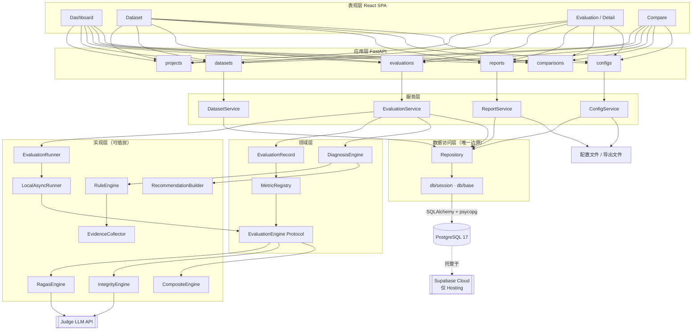
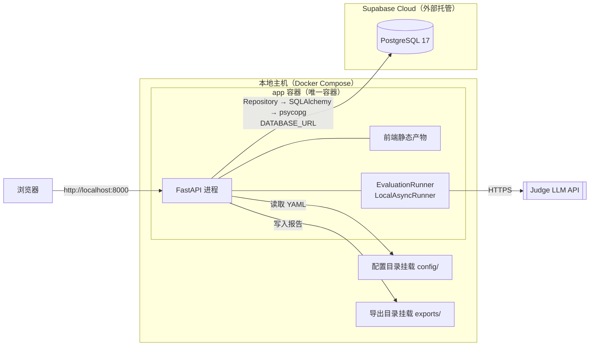
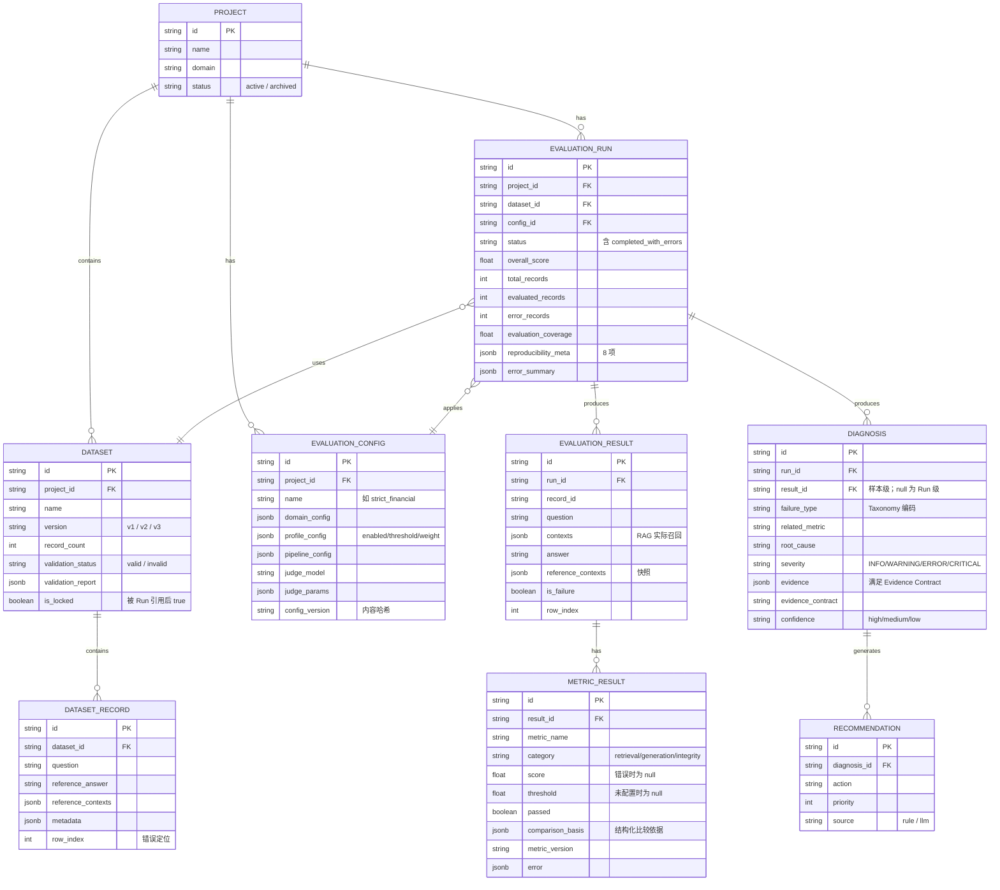
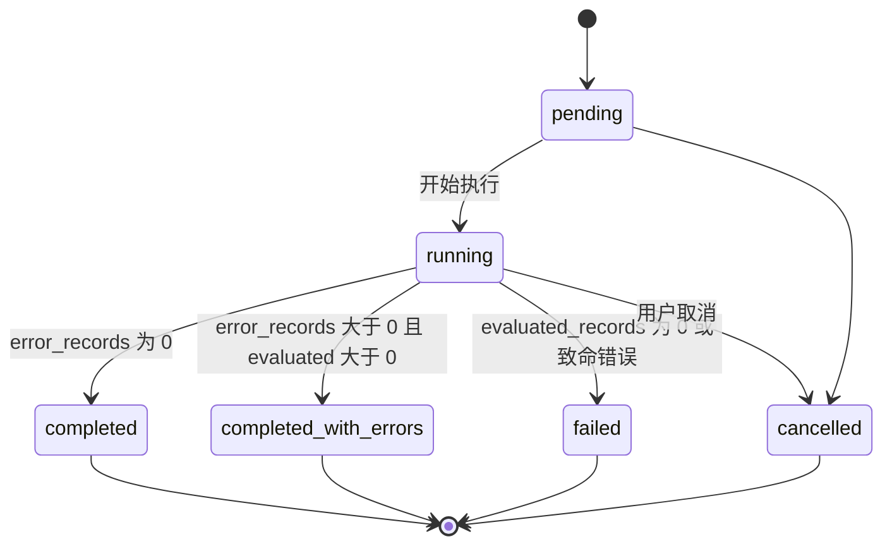
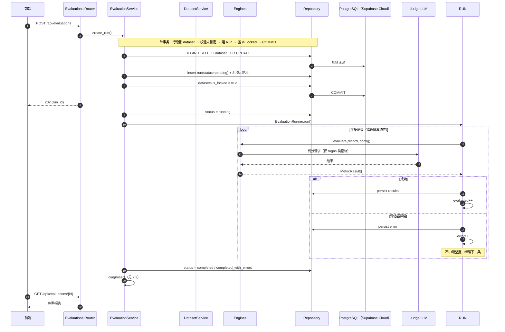
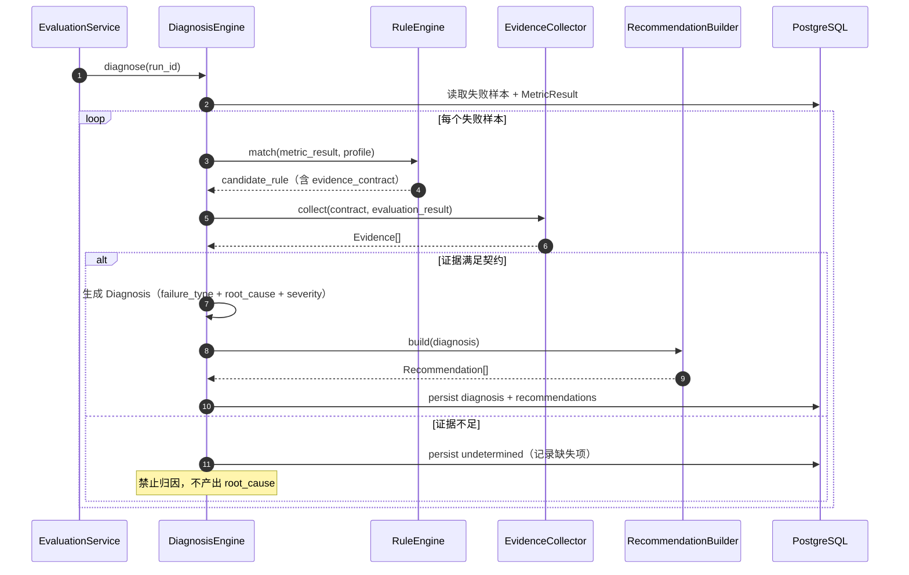

# RAGEval Studio 技术设计规格说明书（Design Spec）

> | 文档名称 | 技术设计规格说明书（Design Spec） |
> |----------|-----------------------------------|
> | 版本 | v2.1 |
> | 架构师角色 | 系统架构师 |
> | 日期 | 2026-08-28 |
> | 状态 | 评审稿 |
> | **依据 PRD** | 《RAGEval Studio 需求规格说明书（PRD）》v1.3（Supabase Cloud 同步版） |
> | 应用部署 | 本地 Docker Compose（**仅 app 容器**） |
> | 数据库 | PostgreSQL 17，由 **Supabase Cloud** 托管 |

> **边界**：PRD 定义 WHY / WHAT / BEHAVIOR / ACCEPTANCE；本文档定义 HOW。
> 所有设计均可回溯到 PRD 的 FR 编号；冲突时以 PRD 为准。
> v2.0 = 结构重构（对齐 design-spec-author 技能的 11 章规范）；
> **v2.1 = 基础设施迁移**（本地 PostgreSQL 容器 → Supabase Cloud 托管 PostgreSQL）。

> ### ⚠️ 本次迁移的性质
>
> ```text
> 这是「PostgreSQL 的运行 / 托管位置发生变化」，
> 不是「PostgreSQL → Supabase Database」的概念替换。
>
> 数据库抽象不变：应用仍然通过 SQLAlchemy 2.0 + psycopg 访问标准 PostgreSQL。
> ```
>
> **明确不引入**：`supabase-py` / Supabase JS SDK / Supabase Auth / Supabase Storage / Supabase Realtime / Supabase Self-Hosted / Redis / Celery / MQ / Kubernetes。
>
> **Supabase 只是基础设施实现，不是系统中心。真正的中心是 RAGEval Domain。**

---

## 1. 架构设计概述

### 1.1 架构风格

**分层单体（Modular Monolith）+ 插件化引擎注册表**

```text
表现层    React SPA（构建产物由 FastAPI 静态托管）
   ↓ REST / SSE
应用层    FastAPI Routers + Service（Dataset / Evaluation / Report / Config）
   ↓ 依赖倒置（Protocol）
领域层    EvaluationRecord · Metric · EvaluationEngine · Diagnosis
   ↓ 注册表解耦
实现层    RagasEngine · IntegrityEngine · CompositeEngine · RuleEngine
   ↓
数据访问  Repository（唯一数据访问边界）
   ↓ SQLAlchemy 2.0 + psycopg[binary]
基础设施  PostgreSQL 17  ←── 由 Supabase Cloud 托管
           文件系统（配置 / 导出，继续本地挂载）
```

核心特征是**依赖倒置**：应用层不依赖任何具体评估库，只依赖 `EvaluationEngine` 协议；新增引擎与指标通过注册表接入，业务层零改动。

**数据库访问链路强制固定为**：

```text
FastAPI
  ↓
Service          业务编排
  ↓
Repository       数据访问边界（唯一允许触碰 ORM 的层）
  ↓
SQLAlchemy 2.0   数据库访问抽象
  ↓
psycopg[binary]  驱动
  ↓
PostgreSQL       数据库事实标准
  ↓
Supabase Cloud   仅提供 Database Hosting
```

> 链路中**不存在** Supabase SDK 环节。迁移到 AWS RDS / Azure PostgreSQL / 自建 PostgreSQL 时，只需更换 `DATABASE_URL`，代码零改动。

### 1.2 选型理由与权衡

| 决策 | 选择 | 放弃的方案 | 放弃的代价 |
|------|------|-----------|-----------|
| 服务粒度 | 单体分层 | 微服务（Dataset / Evaluation / Diagnosis 各自部署） | 放弃独立扩缩容与独立发布；换来零运维成本、无分布式事务、本地一键启动 |
| 执行抽象 | `EvaluationRunner` 抽象 + `LocalAsyncRunner` | 直接 `asyncio.gather` 散落在 Service | 放弃「就地写法」的最短路径；换来 P1 切换 QueueRunner 时不改 Service |
| 引擎解耦 | Protocol + Registry | 工厂 + 条件分支 | 放弃「一处看全逻辑」的直觉性；换来新增引擎不改业务层（PRD Level A 硬约束） |
| 诊断策略 | 规则优先 + LLM fallback | 全 LLM 判断 | 放弃对长尾语义问题的泛化能力；换来可复现、可解释、低成本（PRD 工程原则 3） |
| 配置 | 三层 YAML + 哈希快照 | 数据库配置表 | 放弃运行时热更新；换来版本可追溯、可随代码评审 |
| 存储 | PostgreSQL 单库 | 多库 / 文件仓库 | 放弃按域隔离存储；换来 ER 完整性、事务保障、JSONB 灵活 schema |
| **数据库托管** | **Supabase Cloud** | A. 本地 PostgreSQL 容器；C. Supabase Self-Hosted | 放弃「数据库随 Compose 一键启动」与离线可用性；换来免维护数据库、标准 PostgreSQL 能力保留、未来可迁移（见 ADR-08） |

### 1.3 架构原则（对齐 PRD 工程原则）

| # | 原则 | 落地约束 |
|---|------|---------|
| P-1 | 评估与诊断解耦 | Metric 只产出 `MetricResult`，禁止在指标内部生成 Diagnosis |
| P-2 | 诊断必须有证据 | Diagnosis 出口强制校验 Evidence Contract，不满足即拒绝归因 |
| P-3 | 规则优先于 LLM | Integrity 判定走确定性路径，LLM 仅在 `ambiguous` 时兜底 |
| P-4 | 结果必须可复现 | Run 创建即写入 8 项元信息，配置内容哈希快照 |
| P-5 | 引擎统一接口 | 业务层禁止出现按引擎名的条件分支 |
| P-6 | 不为架构完整而引入复杂度 | MVP 不引入 Redis、消息队列、多租户、链路追踪 |
| **P-7** | **Supabase 只是基础设施，不是架构中心** | 业务代码禁止出现 `supabase_service.py` 之类的 SDK 集中调用；数据库相关代码只存在于 `db/` `repositories/` `configuration/` |
| **P-8** | **Repository 是唯一数据访问边界** | Service 不得直接使用 Session / ORM 查询；所有持久化经 Repository |
| **P-9** | **数据库访问对供应商中立** | 禁止使用 Supabase 专有 SQL / 扩展；仅使用标准 PostgreSQL 能力（JSONB 为 PostgreSQL 原生，允许） |

---

## 2. 技术栈与依赖

### 2.1 技术栈总览

> 标注：**既定** = PRD 第 10 章已定约束；**引入** = 本次设计新增选型，需评审确认。

| 层 | 技术选型 | 用途 | 来源 |
|----|---------|------|------|
| 前端 | React + TypeScript | UI | 既定 |
| 前端 | Ant Design | 组件库 | 既定 |
| 前端 | ECharts | 趋势 / 对比图表 | 既定 |
| 前端 | Axios | HTTP 客户端 + 拦截器 | **引入** |
| 后端 | Python ≥ 3.12 | 运行时 | **引入**（PRD 仅定 Python） |
| 后端 | FastAPI | REST 框架 + OpenAPI 生成 | 既定 |
| 后端 | Pydantic v2 | 跨层数据模型与校验 | 既定 |
| 后端 | SQLAlchemy 2.0 | **ORM / 数据库访问抽象**（声明式） | 既定 |
| 后端 | psycopg[binary] | PostgreSQL 驱动 | 既定 |
| 后端 | Alembic | **业务 Schema 迁移**（唯一迁移体系） | **引入** |
| 后端 | asyncio + BackgroundTasks | 异步执行（封装在 `EvaluationRunner` 内） | 既定 |

**数据库定位（本次迁移核心）**

```text
Database Engine      PostgreSQL 17（版本仅作部署与兼容性基线，不在应用代码硬编码）
Database Provider    Supabase Cloud（仅 Hosting）
ORM                  SQLAlchemy 2.0
Driver               psycopg[binary]
Migration            Alembic
```

| 层 | 技术选型 | 用途 | 来源 |
|----|---------|------|------|
| 存储 | PostgreSQL 17 | 主存储（含 JSONB） | 既定（版本随 Supabase Cloud 目标环境） |
| 存储托管 | Supabase Cloud | **仅提供 Database Hosting** | **引入**（见 ADR-08） |
| 配置 | PyYAML | 三层配置加载 | **引入** |
| 测试 | pytest + pytest-asyncio | 单元 / 集成测试 | **引入** |
| 部署 | Docker + Docker Compose | **单容器**（仅 app）编排 | 既定 |

### 2.1.1 明确排除的依赖

> 以下均**不因使用 Supabase 而引入**（MVP 范围红线）。

```text
❌ supabase-py / supabase-js        数据库访问仍走 SQLAlchemy
❌ Supabase Auth                    PRD 定义 MVP 单人无账号无 RBAC
❌ Supabase Storage                 导出继续走本地 ./exports 挂载
❌ Supabase Realtime                进度用轮询即可
❌ Supabase Self-Hosted             运维复杂度高于 Cloud，MVP 不需要
❌ Redis / Celery / ARQ / Kafka     MVP 不引入持久化任务队列
❌ Kubernetes / Helm                本地单机部署不需要
❌ OpenTelemetry SDK                属 Production Observability，PRD 明确不做
❌ Langfuse / Phoenix SDK 运行时依赖 仅可作为 P1+ 可选 Integration
```

### 2.2 第三方依赖

| 依赖 | 用途 | 版本策略 | 风险与应对 |
|------|------|---------|-----------|
| **Supabase Cloud** | PostgreSQL 托管 | 由 Supabase 平台管理 | **外部依赖、网络依赖**：数据库不再随 Compose 启动；不可达时应用降级为 `database = unavailable` → 健康检查区分 app/db 状态 + 连接重试；本地开发需自备 Supabase 项目 |
| RAGAS | 通用指标计算 | **锁定版本**，记入 `metric_version` | 版本升级会改变指标口径 → 锁定 + 版本登记 + 升级需重跑基准集 |
| Judge LLM API | LLM-as-a-Judge 判分 | MVP 固定单一模型（PRD Q2） | 外部不可控：耗时 / 成本 / 方差 → 固定 `temperature=0` + `retry=3` + 超时 + 记录 model_version |
| openai SDK（或其他 Provider SDK） | Judge 调用 | 锁定 minor | Provider 接口变更 → 封装在 `JudgeClient` 内部，不外泄 |
| psycopg[binary] | PostgreSQL 驱动 | 锁定 | 连接串统一 `postgresql+psycopg://`，迁移/运行/测试三套 URL 分离 |
| 数值/日期解析库 | Integrity 归一化 | 锁定 | 中文数字 / 财年解析需自研规则补足 |

### 2.3 可选集成（非核心依赖，P1 / P2）

```text
RAGEval Core
│
├── Evaluation
├── Diagnosis
├── Evidence
├── Recommendation
└── Regression

可选 Integration（不得反向依赖核心）
├── Langfuse Adapter
├── Phoenix Adapter
└── OpenTelemetry Adapter
```

> 可**借鉴** Langfuse / Phoenix 的 Dataset、Evaluator、Experiment、Run、Score、Version、LLM-as-Judge、Code Evaluator、Comparison 等概念，但**不复制其产品定位**。
> RAGEval 自有核心模型保持：`EvaluationRecord` → `EvaluationRun` → `MetricResult` → `Failure` → `Evidence` → `Diagnosis` → `Recommendation` → `Regression`。

### 2.3 版本锁定策略

- 所有依赖在 `pyproject.toml` 中锁定上界，生成 `requirements.lock`
- RAGAS 与 Judge SDK 的升级必须走「重跑基准数据集 + 对比指标差异」流程
- `metric_version` 与 `prompt_version` 随代码仓库 tag 管理

---

## 3. 模块 / 服务划分

### 3.1 模块拓扑



### 3.2 职责边界

| 模块 | 做什么 | **不做什么** | 对应 FR |
|------|--------|-------------|--------|
| API Routers | HTTP 入参/出参校验、状态码、序列化 | 不含业务规则，不直接访问 ORM 写操作 | FR-36~39 |
| DatasetService | 导入、5 类校验、版本化、预览、锁定 | 不做评估、不修改被锁定的数据集 | FR-03~06 |
| EvaluationService | Run 生命周期、Pipeline 编排、错误隔离、状态判定 | 不计算具体指标、不做诊断推理 | FR-19~22 |
| ReportService | Human/Machine Report 聚合、导出 | 不重新计算指标 | FR-28~32 |
| ConfigService | 三层配置加载与合并、Profile 解析、哈希快照 | 不存储任何「行业默认阈值」 | FR-10~12 |
| MetricRegistry | 指标注册、查找、元信息暴露 | 不提供 UI 注册入口（PRD Q8） | FR-14 |
| EvaluationEngine | 实现统一协议，计算一类指标 | 不跨类计算、不产出 Diagnosis | FR-15~17、FR-42 |
| DiagnosisEngine | 规则匹配、证据校验、根因与建议输出 | 不修改任何指标分数、不写用户系统 | FR-23~27、FR-43 |
| EvidenceCollector | 按 Evidence Contract 采集证据 | 不猜测、不允许返回不完整的证据集 | FR-24 |
| RecommendationBuilder | 由规则模板生成建议 | 绝不产生外部写操作（架构隔离） | FR-26 |
| **EvaluationRunner** | 封装执行抽象，MVP 用 `LocalAsyncRunner`；P1 可换 `QueueRunner` | 不直接散落 `asyncio.gather`；不承载业务规则 | FR-19 |
| **Repository** | **唯一数据访问边界**：所有 ORM 查询与事务 | 不含业务规则；不直接暴露 Session 给 Service | 全局 |
| **db/session · db/base** | Engine、SessionLocal、DeclarativeBase、健康检查 `SELECT 1` | 不含业务表定义（表定义在 models/） | 全局 |

### 3.3 分层依赖规则

```text
API  → Service → Domain → (Engine / Diagnosis 实现)
              ↓
         Repository ──→ db/session ──→ SQLAlchemy ──→ PostgreSQL（Supabase Cloud）
              ↓
         EvaluationRunner（执行抽象）

禁止：
  ✗ Engine → Service            （反向依赖）
  ✗ Domain → FastAPI            （领域层不得感知 Web 框架）
  ✗ Engine A → Engine B         （引擎之间零依赖）
  ✗ Service → Session / ORM     （必须经 Repository，原则 P-8）
  ✗ Service → supabase SDK      （业务层不得绑定供应商，原则 P-7）
  ✗ 任何层硬编码 localhost:5432 （连接信息只能来自 DATABASE_URL）
```

---

## 4. 部署拓扑

### 4.1 环境矩阵

> MVP 为**本地单人工具 + 云端托管数据库**。数据库统一使用 Supabase Cloud，保证 dev / test / demo 库环境一致。

| 环境 | 应用形态 | 数据库 | 环境变量文件 | 差异点 |
|------|---------|--------|-------------|--------|
| dev | 本机 `uvicorn --reload` | Supabase Cloud（默认） | `.env.local` | 日志 DEBUG、CORS 全开 |
| dev-offline（可选） | 本机 `uvicorn` | 临时本地 PostgreSQL | `.env.local` 覆盖 `DATABASE_URL` | **仅开发便利，不作为产品架构**；库结构仍由 Alembic 生成 |
| test | pytest | **独立的 Supabase Test Project** 或临时本地库 | `.env.test` | 强制 `TEST_DATABASE_URL ≠ DATABASE_URL`，否则报错退出 |
| local | `docker compose up`（仅 app） | Supabase Cloud | `.env.local` | 日志 INFO、导出持久化到 `./exports` |
| demo | 同上 + 只读样例数据 | Supabase Cloud | `.env.demo` | 禁用导入外部数据、Judge 可 mock |

**关键约束**：

```text
1. 默认 MVP 环境统一使用 Supabase Cloud —— 开发、测试、演示库环境一致
2. 不再有「生产本地 db」这一形态
3. 测试库禁止指向生产库（见附录 E）
```

> **P1 起**若引入团队内网部署，再补充 staging / prod 与鉴权组件；MVP 不预留 K8s 编排（避免过度设计，原则 P-6）。

### 4.2 部署图



> 已删除：`db` 容器、`postgres:xx` 镜像、`pgdata` 卷、`5432:5432` 端口映射、`depends_on: db`、`wait-for-postgres` 等待逻辑。

### 4.3 容器与配置

| 容器 | 镜像 | 端口 | 挂载 | 健康检查 |
|------|------|------|------|---------|
| app | 自建（backend + 前端产物） | 8000 | `./config` (ro)、`./exports` (rw) | `GET /api/health`（含数据库连通性） |

**compose 中不再存在 db service。** 应用通过 `DATABASE_URL` 连接远程 PostgreSQL。

### 4.3.1 环境变量规范

| 文件 | 用途 | 是否提交 Git |
|------|------|-------------|
| `.env.example` | **仅模板**，占位符，不含真实凭据 | ✅ 提交 |
| `.env.local` | 本地实际配置 | ❌ 不提交 |
| `.env.test` | 测试配置 | ❌ 不提交 |
| 生产 Secret | Secret Manager / 部署环境注入 | ❌ 不提交 |

```env
# .env.example —— 只允许占位符，禁止真实凭据
DATABASE_URL=postgresql+psycopg://<user>:<password>@<host>:<port>/<database>
ALEMBIC_DATABASE_URL=
TEST_DATABASE_URL=
RAGEVAL_ENV=dev
```

### 4.3.2 运行连接与迁移连接分离

```text
DATABASE_URL          应用运行连接（连接池、并发）
ALEMBIC_DATABASE_URL  Alembic 迁移连接（可选）
                      为空时回退到 DATABASE_URL
TEST_DATABASE_URL     测试连接（禁止等于生产 URL）
```

> 区分原因：应用连接侧重连接池与并发；迁移连接更适合直连入口；未来使用 Supabase Pooler 时两者可能采用不同 Endpoint。
> **但不要为了「看起来专业」而强制使用两个不同 Endpoint** —— 当前项目规模下，`ALEMBIC_DATABASE_URL` 留空回退即可。

### 4.3.3 Supavisor / Pooling 定位

```text
应用层只需要：SQLAlchemy Engine + Connection Pool
```

Supabase 的 Supavisor / PgBouncer 属于**部署配置范畴**，不作为新的业务抽象，不修改业务层。仅在生产配置文档（见 `docs/deployment/SUPABASE_CLOUD.md`）中说明如何按 Supabase 当前提供的连接方式选择 pooled / direct connection。

### 4.4 环境差异实现

- 全部通过环境变量注入，配置源为 `config/system.yaml` + `RAGEVAL_*` 覆盖
- `RAGEVAL_ENV` 控制日志级别与 CORS 策略
- **密钥仅通过环境变量注入**，不写入 YAML、不写入数据库、不打印日志
- **代码与配置中禁止硬编码 `localhost:5432` / `127.0.0.1:5432` 作为生产默认值**
- 应用启动时若数据库不可达：**依赖重试与健康检查报错**，而不是等待 docker db 容器就绪

---

## 5. 数据模型（ER）

### 5.1 ER 图

> 与 PRD 8.1 实体初稿一致，并细化到可建表（字段级见 5.2）。

**Schema 所属边界（本次迁移必须明确）**

RAGEval Studio 自己管理以下 10 张业务表，全部由 **Alembic** 管理：

```text
projects           datasets            dataset_records
evaluation_configs evaluation_runs     evaluation_results
metric_results     diagnoses           recommendations
metric_definitions
```

禁止纳入自己的业务 migration：

```text
✗ auth                ✗ storage            ✗ realtime
✗ supabase_* internal schemas
✗ 任何 Supabase 平台自有的系统表
```

> Supabase 只负责 Database Hosting，不参与 RAGEval 的业务 Schema 演进。



### 5.2 表结构（DDL 级）

通用约定：

```text
- 主键：TEXT 存 UUID v4，字段名 id
- 时间：TIMESTAMPTZ，UTC 存储，API 输出 ISO-8601
- JSON：JSONB
- 状态字段：TEXT + 应用层 Enum 校验（不用 DB enum，便于演进）
- 所有表含 created_at TIMESTAMPTZ NOT NULL DEFAULT now()
```

#### projects（FR-01/02）

| 字段 | 类型 | 约束 | 说明 |
|------|------|------|------|
| id | TEXT | PK | UUID |
| name | TEXT | NOT NULL | |
| domain | TEXT | NOT NULL DEFAULT 'general' | 仅用于默认 Profile 提示，不限制能力 |
| status | TEXT | NOT NULL DEFAULT 'active' | active / archived |
| created_at | TIMESTAMPTZ | NOT NULL | |

索引：`(status, created_at DESC)`

#### datasets（FR-03/05）

| 字段 | 类型 | 约束 | 说明 |
|------|------|------|------|
| id | TEXT | PK | |
| project_id | TEXT | FK, NOT NULL | |
| name | TEXT | NOT NULL | 如 `finance-golden` |
| version | TEXT | NOT NULL | v1 / v2 / v3 |
| record_count | INT | NOT NULL DEFAULT 0 | |
| validation_status | TEXT | NOT NULL | valid / invalid |
| validation_report | JSONB | NULL | 可定位到 row_index 的错误明细 |
| is_locked | BOOLEAN | NOT NULL DEFAULT false | 被 Run 引用后置 true |
| created_at | TIMESTAMPTZ | NOT NULL | |

约束：`UNIQUE (project_id, name, version)`
索引：`(project_id, name, version DESC)`

#### dataset_records（FR-04/06）

| 字段 | 类型 | 约束 | 说明 |
|------|------|------|------|
| id | TEXT | PK | |
| dataset_id | TEXT | FK, NOT NULL | |
| question | TEXT | NOT NULL | |
| reference_answer | TEXT | NULL | |
| reference_contexts | JSONB | NULL | 字符串数组 |
| metadata | JSONB | NULL | domain / entity / time |
| row_index | INT | NOT NULL | 源文件行号，用于错误定位 |

索引：`(dataset_id, row_index)`

#### evaluation_configs（FR-10/11/12）

| 字段 | 类型 | 约束 | 说明 |
|------|------|------|------|
| id | TEXT | PK | |
| project_id | TEXT | FK, NOT NULL | |
| name | TEXT | NOT NULL | 如 `strict_financial` |
| domain_config | JSONB | NOT NULL | 领域默认配置快照 |
| profile_config | JSONB | NOT NULL | enabled / threshold / weight / severity |
| pipeline_config | JSONB | NOT NULL | engines / diagnosis enabled |
| judge_model | TEXT | NOT NULL | MVP 单一 Judge |
| judge_params | JSONB | NOT NULL | provider/model/version/temperature/max_tokens/timeout/retry |
| config_version | TEXT | NOT NULL | 合并后配置内容哈希 |
| created_at | TIMESTAMPTZ | NOT NULL | |

约束：`UNIQUE (project_id, name)`
> `threshold` 为 `null` 表示不参与 PASS/FAIL 判定。**平台不预置任何行业默认值**（PRD 附录 B）。

#### evaluation_runs（FR-13/19/20/22）

| 字段 | 类型 | 约束 | 说明 |
|------|------|------|------|
| id | TEXT | PK | |
| project_id | TEXT | FK, NOT NULL | |
| dataset_id | TEXT | FK, NOT NULL | |
| config_id | TEXT | FK, NOT NULL | |
| status | TEXT | NOT NULL | 见 5.3 |
| overall_score | REAL | NULL | 派生值 |
| total_records | INT | NOT NULL DEFAULT 0 | |
| evaluated_records | INT | NOT NULL DEFAULT 0 | |
| error_records | INT | NOT NULL DEFAULT 0 | |
| evaluation_coverage | REAL | NULL | evaluated / total |
| reproducibility_meta | JSONB | NOT NULL | 8 项，见 5.4 |
| error_summary | JSONB | NULL | 错误类型分布 |
| started_at / finished_at | TIMESTAMPTZ | NULL | |
| created_at | TIMESTAMPTZ | NOT NULL | |

索引：`(project_id, created_at DESC)`、`(dataset_id)`

#### evaluation_results（FR-18/21）

| 字段 | 类型 | 约束 | 说明 |
|------|------|------|------|
| id | TEXT | PK | |
| run_id | TEXT | FK, NOT NULL | |
| record_id | TEXT | NOT NULL | 源 EvaluationRecord.id |
| question | TEXT | NOT NULL | |
| contexts | JSONB | NOT NULL | RAG 实际召回 |
| answer | TEXT | NOT NULL | RAG 最终答案 |
| reference_answer | TEXT | NULL | 冗余快照，防数据集变化影响追溯 |
| reference_contexts | JSONB | NULL | 同上 |
| metadata | JSONB | NULL | |
| is_failure | BOOLEAN | NOT NULL DEFAULT false | |
| row_index | INT | NOT NULL | |

索引：`(run_id, is_failure)`、`(run_id, record_id)`

#### metric_results（FR-18）

| 字段 | 类型 | 约束 | 说明 |
|------|------|------|------|
| id | TEXT | PK | |
| result_id | TEXT | FK, NOT NULL | |
| metric_name | TEXT | NOT NULL | |
| category | TEXT | NOT NULL | retrieval / generation / integrity |
| score | REAL | NULL | 评估器报错时为 NULL |
| threshold | REAL | NULL | 来自 Profile |
| passed | BOOLEAN | NULL | threshold 为 NULL 时为 NULL |
| comparison_basis | JSONB | NULL | 结构化比较依据，见附录 A.6.5 |
| metric_version | TEXT | NOT NULL | |
| error | JSONB | NULL | 评估器异常详情 |

索引：`(result_id, metric_name)`

#### diagnoses（FR-23/24/25）

| 字段 | 类型 | 约束 | 说明 |
|------|------|------|------|
| id | TEXT | PK | |
| run_id | TEXT | FK, NOT NULL | |
| result_id | TEXT | FK, **NULL 有语义**，见 5.3.3 | 样本级 / Run 级 |
| failure_type | TEXT | NOT NULL | Taxonomy 编码，见附录 A.5.1 |
| related_metric | TEXT | NULL | |
| root_cause | TEXT | NOT NULL | 如 `Numerical Mismatch` |
| severity | TEXT | NOT NULL | INFO/WARNING/ERROR/CRITICAL |
| evidence | JSONB | NOT NULL | 标准化结构，见附录 A.5.4 |
| evidence_contract | TEXT | NOT NULL | 所适用契约标识（含版本后缀，如 `.v1`） |
| confidence | TEXT | NOT NULL | high / medium / low |
| created_at | TIMESTAMPTZ | NOT NULL | |

索引：`(run_id, severity)`、`(run_id, failure_type)`、`(result_id)`

#### recommendations（FR-26）

| 字段 | 类型 | 约束 | 说明 |
|------|------|------|------|
| id | TEXT | PK | |
| diagnosis_id | TEXT | FK, NOT NULL | |
| action | TEXT | NOT NULL | 建议动作文本 |
| priority | INT | NOT NULL | 1 最高 |
| source | TEXT | NOT NULL | rule / llm |

#### metric_definitions（FR-14，可选镜像表）

代码注册的镜像，仅用于 UI 展示与 Run 快照，**不是注册入口**（PRD Q8 已决策 MVP 不做 UI 注册）。

| 字段 | 类型 | 说明 |
|------|------|------|
| id | TEXT | PK |
| name | TEXT | 唯一指标名 |
| category | TEXT | retrieval / generation / integrity |
| engine | TEXT | 引擎标识 |
| version | TEXT | 指标实现版本 |
| description | TEXT | |
| input_requirements | JSONB | 所需 EvaluationRecord 字段 |
| default_severity | TEXT | 平台默认建议，可被 Profile 覆盖 |

### 5.3 状态机

#### EvaluationRun



判定规则（**不使用任何百分比阈值**，PRD Q6）：

```text
evaluated == total 且 error == 0     → completed
evaluated > 0    且 error > 0        → completed_with_errors
evaluated == 0                        → failed
```

#### Dataset

```text
draft ──校验通过──> valid ──被 Run 引用──> locked
  │                                          │
  └──校验失败──> invalid                      └──拒绝一切写操作；修正须新建 version
```

**不能只靠 Service 层判断**（并发下两个请求可能同时读到 `is_locked = false`）。必须在 **Repository / Transaction 层**加保障：

```text
Transaction
  ↓ SELECT ... FOR UPDATE（或等价的行级锁）锁定 dataset 行
  ↓ Verify: is_locked == false，否则中止
  ↓ Create Run（写入 8 项元信息）
  ↓ Set datasets.is_locked = true
  ↓ COMMIT
```

> 避免两个请求同时针对同一 Dataset 创建 Run 产生竞态。至少在 Repository / Transaction 层保证；数据库侧可辅以部分唯一索引或约束强化。

#### 5.3.3 Sample Diagnosis vs Run Diagnosis

```text
result_id != null  →  Sample Diagnosis（某一条数据为什么失败）
result_id == null  →  Run Diagnosis（整个 Run 为什么出现整体质量问题）
```

两者**不得混为一个概念**：

| 类型 | 粒度 | 典型 failure_type | evidence 来源 |
|------|------|------------------|--------------|
| Sample Diagnosis | 单条样本 | `integrity.numerical_mismatch`、`retrieval.missing_evidence` | 该样本的 reference / retrieved / answer |
| Run Diagnosis | 整个 Run | `retrieval.knowledge_coverage`、整体指标退化 | 跨样本聚合证据（失败率分布、指标分布） |

接口层通过 `result_id` 是否为 null 区分，UI 分开展示。

### 5.4 可复现元信息（8 项，PRD Level A）

```json
{
  "dataset_version": "v3",
  "config_version": "sha256:9f2c...",
  "metric_version": "2026.08.1",
  "prompt_version": "2026.08.1",
  "judge_model": "gpt-4o-mini",
  "judge_model_version": "gpt-4o-mini-2024-07-18",
  "model_version": "n/a",
  "timestamp": "2026-08-28T14:20:31Z"
}
```

> **可复现性 = 可追溯评估口径与执行上下文**，不要求 LLM 输出逐字一致（PRD SC-6）。

### 5.5 索引与写入策略

- `evaluation_results` / `metric_results` 为写入密集表，MVP 数据量（≤1000 条/数据集）不做分区
- 批量写入使用 `bulk_insert_mappings`，避免逐条 flush
- 索引清单必须与 5.2 各表定义一致；迁移后需核对 FK / Index / Unique / NOT NULL / JSONB / Timestamp 全部落地

### 5.6 数据库版本基线

```text
PostgreSQL 17
```

- 版本**仅作为部署与兼容性基线**，**不在应用代码里硬编码**
- 允许使用的 PostgreSQL 能力：JSONB、部分索引、CTE、窗口函数
- **禁止**使用 Supabase 专有扩展 / 专有 SQL（原则 P-9），以保证可迁移到 RDS / Azure / 自建 PostgreSQL

### 5.7 迁移策略（Alembic 为唯一迁移体系）

> **不因为使用 Supabase 就改用 `supabase db push`。** Alembic 是本项目已定义的工程边界。

```text
SQLAlchemy Models
       ↓
    Alembic
       ↓
 Business Schema（10 张业务表）
       ↓
 Supabase Cloud PostgreSQL
```

Supabase 只负责 Database Hosting，不参与 Schema 演进。

#### 5.7.1 迁移连接

```text
ALEMBIC_DATABASE_URL  可选；为空时回退 DATABASE_URL
```

#### 5.7.2 空库初始化

Supabase Cloud 上若数据库为空：

```text
1. 创建 Supabase Project
2. 获取 PostgreSQL Connection String → 写入 DATABASE_URL
3. alembic upgrade head
4. 验证 10 张业务表创建成功
```

**禁止在 Supabase Dashboard 手工一张表一张表创建。**

#### 5.7.3 已存在历史表的升级流程

```text
Schema Inspection
  ↓
Migration Compatibility Check
  ↓
Backup / Snapshot（Supabase 快照）
  ↓
Alembic Upgrade
  ↓
Smoke Test
```

**禁止 `Drop Database → Create Again`**，除非明确是一次性全新 MVP 数据库。

#### 5.7.4 迁移测试要求

```text
空 Supabase 库
  ↓ alembic upgrade head
所有业务表创建成功
  ↓
基础 CRUD
  ↓
Evaluation Run 端到端
  ↓
Rollback / Downgrade（仅限开发环境）
```

生产升级路径：`Backup → Migration → Smoke Test`。

---

## 6. 关键接口定义

### 6.1 接口约定

| 项 | 约定 |
|----|------|
| 前缀 | `/api` |
| 内容类型 | `application/json; charset=utf-8` |
| 分页 | `?page=1&page_size=20` → `{items, total, page, page_size}` |
| 排序 | `?sort=created_at&order=desc` |
| 时间 | ISO-8601，UTC |
| 幂等 | 创建类接口不保证幂等；取消类接口幂等 |
| 命名 | API 与数据库 `snake_case`；前端 TS 侧转 `camelCase` |

### 6.2 核心 API 契约

> 完整端点清单见附录 C。以下为 8 个核心接口。

| 编号 | 方法 | 路径 | 说明 | 对应 FR |
|------|------|------|------|--------|
| API-01 | POST | `/api/projects` | 创建项目 | FR-01 |
| API-02 | POST | `/api/projects/{pid}/datasets:import` | 导入并校验数据集 | FR-04/05 |
| API-03 | POST | `/api/evaluations` | 发起评估（异步） | FR-19 |
| API-04 | GET | `/api/evaluations/{id}` | Run 详情（含 coverage） | FR-20/22/38 |
| API-05 | GET | `/api/reports/{run_id}` | Human Report 聚合 | FR-28/29 |
| API-06 | GET | `/api/reports/{run_id}/machine` | Machine Report | FR-30 |
| API-07 | GET | `/api/evaluations/{id}/diagnoses` | 诊断列表 | FR-23/24/25 |
| API-08 | GET | `/api/comparisons` | 版本对比与回归 | FR-33/34 |

### 6.3 OpenAPI 片段（API-03 发起评估）

```yaml
post:
  summary: 发起评估（异步执行）
  operationId: createEvaluation
  requestBody:
    required: true
    content:
      application/json:
        schema:
          type: object
          required: [project_id, dataset_id, config_id]
          properties:
            project_id:      { type: string }
            dataset_id:      { type: string }
            config_id:       { type: string }
            pipeline:
              type: object
              properties:
                engines:   { type: array, items: { type: string } }
                diagnosis: { type: object, properties: { enabled: { type: boolean } } }
            metric_overrides:
              type: object
              additionalProperties:
                type: object
                properties:
                  enabled:   { type: boolean }
                  threshold: { type: number, nullable: true }
                  weight:    { type: number, nullable: true }
  responses:
    '202':
      description: 已接受，异步执行
      content:
        application/json:
          schema:
            type: object
            properties:
              run_id: { type: string }
              status: { type: string, enum: [pending] }
              reproducibility_meta: { type: object }
    '400':
      description: 参数错误，错误码 BIZ_VALIDATION_FAILED
    '404':
      description: 资源不存在，错误码 BIZ_NOT_FOUND
    '409':
      description: 状态冲突，错误码 BIZ_DATASET_LOCKED / BIZ_CONFIG_INVALID
```

### 6.4 请求 / 响应示例（API-03 / API-04）

**请求**

```http
POST /api/evaluations
Content-Type: application/json

{
  "project_id": "p-001",
  "dataset_id": "ds-003",
  "config_id": "cfg-012",
  "pipeline": {"engines": ["ragas", "integrity"], "diagnosis": {"enabled": true}},
  "metric_overrides": {
    "numerical_consistency": {"enabled": true, "threshold": 0.95}
  }
}
```

**响应 202**

```json
{
  "run_id": "run-027",
  "status": "pending",
  "reproducibility_meta": {
    "dataset_version": "v3",
    "config_version": "sha256:9f2c...",
    "metric_version": "2026.08.1",
    "prompt_version": "2026.08.1",
    "judge_model": "gpt-4o-mini",
    "judge_model_version": "gpt-4o-mini-2024-07-18",
    "model_version": "n/a",
    "timestamp": "2026-08-28T14:20:31Z"
  }
}
```

**API-04 响应（含 coverage）**

```json
{
  "run_id": "run-027",
  "status": "completed_with_errors",
  "overall_score": 87.4,
  "coverage": {
    "total_records": 1000,
    "evaluated_records": 997,
    "error_records": 3,
    "evaluation_coverage": 0.997
  },
  "metrics": {
    "faithfulness": 0.91,
    "context_recall": 0.84,
    "entity_consistency": 0.97,
    "temporal_consistency": 0.95,
    "numerical_consistency": 0.99
  }
}
```

### 6.5 错误码体系

段位划分：

```text
BIZ_   业务规则错误（4xx，客户端可处理）
SYS_   系统内部错误（5xx）
EXT_   外部依赖错误（Judge LLM / 数据库不可用）
```

| 错误码 | HTTP | 含义 | 处理建议 |
|--------|------|------|---------|
| `BIZ_VALIDATION_FAILED` | 400 | 数据集校验不通过 | 展示 validation_report |
| `BIZ_NOT_FOUND` | 404 | 资源不存在 | — |
| `BIZ_DATASET_LOCKED` | 409 | 数据集已被 Run 引用，不可修改 | 引导创建新版本 |
| `BIZ_CONFIG_INVALID` | 409 | 配置不合法（如启用未注册指标） | 展示缺失项 |
| `BIZ_METRIC_INPUT_MISSING` | 400 | 指标所需输入字段缺失 | 提示补齐字段 |
| `BIZ_RUN_NOT_CANCELLABLE` | 409 | Run 已处于终态 | 刷新状态 |
| `BIZ_ADAPTER_PARSE_ERROR` | 400 | 输入格式无法解析 | 提示格式要求 |
| `SYS_INTERNAL` | 500 | 未分类内部错误 | 携带 trace_id |
| `SYS_INSUFFICIENT_EVIDENCE` | 500 | 诊断证据不满足契约（内部一致性错误） | 记录并告警，标记 undetermined |
| `EXT_JUDGE_UNAVAILABLE` | 503 | Judge LLM 不可达 | 重试；已评估结果保留 |
| `EXT_DB_UNAVAILABLE` | 503 | Supabase Cloud PostgreSQL 不可达 | 检查 `DATABASE_URL` 与网络；**不是**重启本地容器能解决的问题 |

统一错误响应体：

```json
{
  "detail": "...",
  "code": "BIZ_DATASET_LOCKED",
  "trace_id": "0c1f...",
  "context": {"dataset_id": "ds-003", "run_id": "run-027"}
}
```

---

## 7. 关键流程时序图

### 7.1 评估执行全流程（P0 主链路）



### 7.2 诊断与证据采集流程



> 关键：第 8 步的分支是 PRD「禁止仅依据 Metric Score 推断 Root Cause」的落地点。

---

## 8. 非功能设计

> 原则：PRD 的每条指标必须有对应的**设计手段**，只复述指标视为未完成。

### 8.1 PRD 指标 → 设计手段映射

| PRD 指标 | 层级 | 设计手段 |
|---------|------|---------|
| Diagnosis 必须有 Evidence | **A** | `DiagnosisEngine` 出口契约校验 + `evidence` NOT NULL + 单测覆盖 14 类契约 |
| Dataset Version 被引用后不可修改 | **A** | `is_locked` + **Repository 层事务内行级锁**（`SELECT ... FOR UPDATE`）+ 409 `BIZ_DATASET_LOCKED` + 并发单测（见 5.3） |
| 单条错误不中断整批 | **A** | 每记录 `try/except` 包裹 + 错误明细落 `metric_results.error` + `error_records` 计数 |
| 敏感 Key 不落库 / 不落日志 | **A** | 环境变量注入 + Pydantic `SecretStr` + 日志 redact filter（按 `redact_fields`）+ 日志断言测试；`DATABASE_URL` 同样视为 Secret |
| 8 项可复现元信息完整 | **A** | 建 Run 时一次性写入 + NOT NULL 约束 + Pydantic 全字段必填 |
| 4 阶段日志覆盖 | **A** | 结构化日志中间件，在导入/评估/诊断/报告四处埋点 |
| 新增指标业务层改动 0 处 | **A** | 引擎 Protocol + Registry 注册；CI 加静态检查禁止引擎名分支 |
| 数据库访问供应商中立 | **A** | 全量经 Repository；CI 加静态检查禁止 `supabase` 客户端出现在 `api/` `services/` `domain/` |
| 1000 条 ≤ 30 min | B | Judge 调用批量并发（`asyncio.Semaphore` 控制并发度）+ HTTP 连接复用 + 并发度可配置 |
| 报告页首屏 P95 ≤ 2s | B | `(run_id, is_failure)` 索引 + 分页 + 报告聚合结果落 `evaluation_runs` 避免实时聚合 |
| 失败样本查询 P95 ≤ 500ms | B | 复合索引 + 游标分页 + 列表页不返回 contexts 正文 |
| 版本对比 ≤ 5s | B | 仅读两个 Run 的聚合指标，不扫描明细 |
| 并发 Run ≥ 1 | B | 同一数据集由 `datasets.is_locked` 行锁互斥；不同数据集可并发；记录级并发为 `LocalAsyncRunner` 的 `asyncio.Semaphore`；P1 再引入队列 |
| Judge 方差 / 稳定性 | C | 固定 `temperature=0` + 固定 prompt/model 版本 + 提供 Benchmark 脚本统计方差 |
| **云端数据库往返开销** | C | 连接池 `pool_pre_ping` + 合理 `pool_size`（默认 5/10）；批量写入减少往返；实测后定基线 |
| 浏览器兼容 Chrome/Edge | B | Vite 构建目标 `es2020`；Ant Design 5 官方支持矩阵 |

### 8.2 安全

| 项 | 设计手段 |
|----|---------|
| **数据库连接凭据** | `DATABASE_URL` 仅经环境变量注入；**禁止**写入 YAML / 数据库 / 报告 / 日志 / 代码；`.env.local` `.env.test` 不进 Git（`.gitignore` 强制） |
| 密钥管理 | Judge API Key 同理；Pydantic `SecretStr` |
| 日志脱敏 | 日志 filter 按 `system.logging.redact_fields` 对 `api_key` / `authorization` / **连接串密码**做掩码 |
| 数据边界 | 业务数据落 Supabase Cloud PostgreSQL（用户自有项目）；导出文件落本地 `./exports`；Judge 调用仅发送判定所需最小文本 |
| 注入防护 | 全量使用 SQLAlchemy 参数化查询；禁止字符串拼接 SQL |
| 文件上传 | 导入限制最大体积与解析超时；JSON 解析器禁用超大嵌套 |
| 认证鉴权 | **MVP 无**（PRD P2：单人、无账号、无 RBAC）；`api/` 预留依赖注入点。**不因使用 Supabase 而提前接入 Supabase Auth** |
| 传输安全 | 与 Supabase 的连接强制 TLS（连接串带 `sslmode=require`） |
| 备份 | 依赖 Supabase 平台快照；迁移前必须手动触发一次备份（见 5.7.3） |
| 本地暴露面 | 仅 app 监听 8000；**不存在 db 容器**，无 5432 暴露面 |

### 8.3 性能

| 手段 | 应用场景 |
|------|---------|
| 复合索引 | `evaluation_results(run_id, is_failure)`、`metric_results(result_id, metric_name)`、`diagnoses(result_id)` |
| 批量写入 | `bulk_insert_mappings` 批量落库，避免逐条 flush；**对云端库尤其重要**（减少网络往返） |
| 异步并发 | Judge 调用 `asyncio.gather` + `Semaphore` 限流（并发度可配置，默认 8） |
| 连接复用 | httpx AsyncClient 单例 + 连接池 |
| **DB 连接池** | SQLAlchemy `QueuePool`：`pool_size=5`、`max_overflow=5`、`pool_pre_ping=True`、`pool_recycle=1800`；避免云端连接被服务端回收后拿失效连接 |
| 聚合预计算 | `overall_score` / `evaluation_coverage` 在 Run 结束时写入，读取不再聚合 |
| 分页 | 所有列表接口强制分页，默认 20 |
| 列表裁剪 | 列表接口不返回 `contexts` 正文，详情接口才返回 |

### 8.4 高可用与可靠性

> 本地单机 + 云端托管数据库场景**不设 SLA**（PRD Level B）。可靠性通过以下手段保障：

| 手段 | 说明 |
|------|------|
| 错误隔离 | 单条记录异常不影响整批，计入 `error_records` |
| 重试 | Judge 调用 `retry=3` + 指数退避；超时由 `judge.timeout` 控制 |
| **数据库瞬断重试** | 连接层 `pool_pre_ping` + 关键写操作有限重试；区分「瞬断可重试」与「配置错误不可重试」 |
| **数据库不可达时的行为** | 依赖 retry + health check + 明确报错（`EXT_DB_UNAVAILABLE`），**不是**等待 docker db 容器启动 |
| 断点保留 | 已落库的 `evaluation_results` 在 Run 失败后仍可查询 |
| 取消安全 | 每处理完一条记录检查取消标志；已落库结果保留 |
| 无状态应用层 | app 容器无本地状态，重建不影响业务数据（数据在 Supabase Cloud） |
| 事务边界 | 单条记录的落库为一个事务；整批不做大事务，避免长锁；**建 Run + 锁定 Dataset 必须在同一事务**（见 5.3） |
| 降级 | Judge 不可用时，Integrity 等确定性指标仍可完成，Run 标记 `completed_with_errors` |
| **任务持久化的已知限制** | `LocalAsyncRunner`：**进程重启 → 运行中任务可能丢失，但已落库结果保留**（见 ADR-09）。P1 再考虑持久化队列 |

### 8.5 可观测

| 手段 | 说明 |
|------|------|
| 结构化日志 | JSON 格式输出，含 `trace_id` / `run_id` / `stage` |
| 阶段埋点 | 导入 / 评估 / 诊断 / 报告 四阶段各写入开始与结束日志 |
| **健康检查（必须改造）** | `GET /api/health` 改为：`FastAPI → SQLAlchemy → SELECT 1 → Supabase PostgreSQL`。**不再依赖 db 容器名 / `pg_isready`** |
| **健康状态区分** | 响应至少区分 `app = healthy` 与 `database = healthy / unavailable` 两部分 |
| 错误分类 | `error_summary` 按错误类型聚合，暴露在 Run 详情 |
| 指标暴露 | MVP 不做 Prometheus（避免过度设计）；P1 视需要引入 |
| 链路追踪 | **不做**（属 Production Observability，PRD 明确不做） |
| 链路追踪 | **不做**——属 Production Observability，PRD 明确不在范围（与 Langfuse/Phoenix 互补） |

---

## 9. 设计决策记录（ADR）

| 编号 | 决策 | 背景 / 选项 | 选择理由 | 后果 |
|------|------|------------|---------|------|
| **ADR-01** | 采用**分层单体**，非微服务 | 选项 A：微服务（Dataset/Evaluation/Diagnosis 独立部署）；选项 B：分层单体 | MVP 为本地单人工具，数据量 ≤1000 条/集；微服务引入分布式事务、服务发现、多容器编排，显著抬高运维成本，与「一键 Compose 启动」目标冲突 | 无法独立扩缩容；评估为 CPU/IO 密集时会占用整机。P1 若需并发，先拆进程内并发而非拆服务 |
| **ADR-02** | MVP **不引入 Redis / 消息队列** | 选项 A：Redis + Celery；选项 B：BackgroundTasks + asyncio | 任务规模小、单机单用户；引入队列需额外 2 个容器并带来任务持久化/重试复杂度，属「为架构完整而引入复杂度」 | 无任务持久化，进程重启即丢失运行中任务；无跨进程重试。P1 出现长任务/并发/取消需求时再引入 |
| **ADR-03** | 引擎抽象用 **Protocol + Registry**，禁止条件分支 | 选项 A：`if engine == "ragas"` 工厂分支；选项 B：Protocol + Registry 注册 | PRD 架构约束 5 明确禁止业务层按引擎名分支；Level A 要求新增指标业务层改动 0 处 | 调试时无法「一处看全逻辑」，需查注册表；换来新增引擎零改动接入 |
| **ADR-04** | 诊断采用**规则优先 + LLM fallback**（Deterministic-first Hybrid） | 选项 A：全 LLM 判断；选项 B：规则优先 + LLM 兜底 | LLM 判断不可复现、成本高、无法给出确定性证据；数字/日期/实体/单位等可确定性判定 | 长尾语义问题覆盖不足；对无法确定性判定的场景输出 `ambiguous` 而非猜测分数 |
| **ADR-05** | 配置采用**三层 YAML + 内容哈希快照** | 选项 A：数据库配置表；选项 B：YAML + 哈希 | 可复现性要求 Run 必须锁定当时的配置；YAML 可随代码评审，哈希天然满足快照需求 | 无运行时热更新；改配置需重新创建/选择配置后发起新 Run |
| **ADR-06** | Dataset Version **不可变**（`is_locked` 强约束） | 选项 A：允许修订历史版本；选项 B：锁定 + 升版本 | 评估结果的可追溯性依赖数据集不可变；允许修订会使历史 Run 结论失效（PRD Q7 已决策） | 修正数据须升版本，会产生多个版本；换来 Reproducibility 成立 |
| **ADR-07** | Evidence **契约强制校验**，禁止 `evidence.length >= 1` | 选项 A：统一「至少 1 条证据」；选项 B：按 Diagnosis 类型定义最小充分证据集 | 不同失败类型所需证据不同（如 Top-K 问题必须带 top_k 配置，缺失则归因不成立）；统一规则会让无证据的猜测通过校验 | 契约表需随规则增长维护；证据不足时输出 `undetermined` 而非强行归因，短期看起来「诊断少」 |
| **ADR-08** | 数据库托管改用 **Supabase Cloud**，访问层仍为 SQLAlchemy + Alembic | 选项 A：本地 PostgreSQL Docker 容器；选项 B：Supabase Cloud；选项 C：Supabase Self-Hosted | ① 无需维护数据库容器；② 标准 PostgreSQL 能力完整保留；③ 适合 MVP 规模；④ 运维复杂度低于 Self-Hosted；⑤ 未来可迁移（RDS / Azure / 自建） | ① 依赖外部网络，数据库不再随 Compose 一键启动；② 需管理 `DATABASE_URL` 这一 Secret；③ 本地开发需自备 Supabase 项目；④ 迁移前必须备份。**应用代码零改动即可换回任意 PostgreSQL** |
| **ADR-09** | 引入 **EvaluationRunner** 执行抽象（MVP 用 `LocalAsyncRunner`） | 选项 A：`EvaluationService` 内直接 `asyncio.gather`；选项 B：抽象 `EvaluationRunner` + `LocalAsyncRunner` / `QueueRunner` | 现在不引入队列复杂度，但为 P1 切换持久化队列保留正确边界；Service 不绑定具体并发原语 | 多一层间接；短期只有一个实现。换来 P1 接入 Redis/Celery/ARQ 时不改动 Service 与业务规则 |

---

## 10. 任务分解清单

### 10.1 任务表

> 依赖列为空表示可立即开始；同一「并行组」内任务可并行。

| 任务编号 | 模块 | 依赖 | 并行组 | 说明 |
|---------|------|------|--------|------|
| T-01 | 工程骨架 | — | G0 | 目录结构（含 `db/` `repositories/` `runner/`）、Dockerfile、**compose 仅 app 容器**、`/api/health`、日志与配置加载 |
| T-02 | 数据模型 | T-01 | G1 | SQLAlchemy 模型 + Alembic 初始迁移（10 张业务表 + 索引） |
| T-03 | 领域模型 | T-01 | G1 | `EvaluationRecord` / `MetricResult` / `Evidence` / `Diagnosis` Pydantic 模型 |
| T-04 | 配置体系 | T-01 | G1 | 三层 YAML 加载、合并、哈希、Profile 解析（FR-10/11/12） |
| **T-24** | **数据库接入层** | T-01 | **G1** | `db/session.py`（Engine + SessionLocal + 连接池参数）、`db/base.py`、Repository 基类、`DATABASE_URL` / `ALEMBIC_DATABASE_URL` / `TEST_DATABASE_URL` 三套连接 |
| **T-25** | **Supabase Cloud 接入** | T-24 | **G1** | 创建 Supabase Project、`DATABASE_URL` 配置、`alembic upgrade head` 建表、验证 10 张表（见 `docs/deployment/SUPABASE_CLOUD.md`） |
| **T-26** | **健康检查改造** | T-24 | **G1** | `GET /api/health` 改为 `SQLAlchemy → SELECT 1`，响应区分 `app` 与 `database` 状态 |
| T-05 | Metric Registry | T-03 | G2 | 注册机制 + `list_metrics` / `get_metric`（FR-14） |
| T-06 | EvaluationEngine 协议 | T-05 | G2 | Protocol 定义 + Pipeline 编排骨架（FR-12） |
| T-07 | Dataset 导入与校验 | T-02, T-04, T-24 | G2 | JSON Import Adapter + 5 类校验 + 版本化 + **事务内行级锁**（FR-03~06） |
| **T-27** | **EvaluationRunner 抽象** | T-06 | **G2** | `EvaluationRunner` 协议 + `LocalAsyncRunner`（`Semaphore` 限流）；Service 不直接写 `asyncio.gather` |
| T-08 | RagasEngine | T-06 | G3 | 接入 RAGAS，实现 retrieval / generation 4 指标（FR-15） |
| T-09 | Integrity 归一化库 | T-03 | G3 | Entity / Temporal / Numerical 抽取与归一化（附录 A.6） |
| T-10 | IntegrityEngine | T-09 | G3 | 3 个一致性指标 + `comparison_basis` 输出（FR-16）；与 T-08 可并行 |
| T-11 | CompositeEngine | T-08, T-10 | G4 | 按 Profile 权重计算 `overall_score`（FR-29） |
| T-12 | EvaluationService | T-06, T-07, T-11, T-27 | G4 | Run 生命周期、错误隔离、状态判定、coverage（FR-19~22） |
| T-13 | Failure Taxonomy | T-05 | G3→G4 | 14 类编码表与规则数据结构（附录 A.5.1） |
| T-14 | EvidenceCollector | T-13, T-03 | G4 | 8 类证据采集 + 契约校验 + **标准化 JSON 结构**（FR-24） |
| T-15 | RuleEngine | T-13, T-14 | G5 | MVP 首批 10~15 条规则（FR-23/43） |
| T-16 | DiagnosisEngine | T-15, T-14 | G5 | 编排、契约守门、`undetermined` 处理、Sample/Run Diagnosis 区分（FR-23/25） |
| T-17 | RecommendationBuilder | T-16 | G5 | 规则模板生成建议（FR-26） |
| T-18 | ReportService | T-12, T-16 | G6 | Human + Machine Report + JSON 导出（FR-28~31） |
| T-19 | REST API 全量 | T-18, T-26 | G6 | 端点清单（附录 C） |
| T-20 | 前端页面 | T-19 | G7 | Dashboard / Dataset / Evaluation / Detail / Compare（FR-36~39） |
| T-21 | 版本对比与回归 | T-18 | G6 | 变化量与回归告警（FR-33/34） |
| T-22 | 测试补齐 | T-12~T-27 | G8 | 不变量测试 + AC 映射 + **迁移测试 + 测试库隔离断言**（附录 E） |
| T-23 | 部署与冒烟 | T-20, T-22, T-25 | G9 | Compose（仅 app）启动验证、导出目录、健康检查（FR-40） |

### 10.2 依赖图（关键路径）

```text
G0 → G1 → G2 → G3 → G4 → G5 → G6 → G7 → G8 → G9
      │     │     │     │     │
      │     │     │     │     └─ T-13 Taxonomy（可与 G3 并行）
      │     │     │     └─ T-12 EvaluationService（关键路径）
      │     │     └─ T-09/T-10 Integrity（可与 T-08 并行）
      │     └─ T-07 Dataset（可与 T-05/T-06 并行）
      └─ T-03 领域模型（T-05/T-09 的前置）
```

**关键路径**：`T-01 → T-03 → T-05 → T-06 → T-08/T-10 → T-11 → T-12 → T-16 → T-18 → T-19 → T-20`

> **第一批要写的代码是 T-03 与 T-05/T-06**（四个核心抽象），而非前端页面。抽象正确，后续引擎与 UI 可逐步接入而不推翻架构。

### 10.3 里程碑

| 里程碑 | 包含任务 | 完成标志 |
|--------|---------|---------|
| **M0 数据底座** | T-24, T-25, T-26 | Supabase Cloud 连通、`alembic upgrade head` 建齐 10 张表、`/api/health` 返回 `database: healthy` |
| M1 抽象就位 | T-01~T-06, T-27 | 可用 Python 脚本跑通「Record → Metric → Result」最小链路 |
| M2 引擎可算 | T-07~T-11 | 1000 条数据集跑完并产出全部指标 |
| M3 诊断闭环 | T-12~T-17 | 失败样本产出带证据的诊断与建议 |
| M4 报告可用 | T-18, T-21 | Machine Report JSON 可导出、两 Run 可对比 |
| M5 前端可用 | T-19, T-20 | 5 个页面联通 |
| M6 可交付 | T-22, T-23 | Compose（仅 app）启动 + 冒烟通过，无 db service |

---

## 11. 待明确事项

| 编号 | 问题 | 影响 | 建议确认方 |
|------|------|------|-----------|
| S-1 | Judge Model 具体选型与参数基线（温度、超时、并发度默认值） | T-08、性能目标 | 技术负责人（PRD Q2） |
| S-2 | Integrity Metrics 容差默认值与归一化规则细节（单位表是否够用、跨币种如何处理） | T-09、T-10 | 算法负责人（PRD Q4） |
| S-3 | MVP 首批诊断规则的最终 10~15 条清单（从 14 条候选集中选哪些） | T-15 | 算法负责人 + 产品（PRD Q5） |
| S-4 | Evidence Contract 中各契约的字段级细化（如 `top_k` 从何处读取） | T-14 | 架构评审（PRD Q9） |
| S-5 | 性能基线与 Judge variance 的实测方法（Benchmark 脚本口径） | T-22 | 技术负责人（PRD Q1 Level C） |
| S-6 | 前端是否需要 Run 进度 SSE，还是轮询即可（影响是否需要额外端点） | T-20 | 前端负责人 |
| S-7 | `metric_definitions` 镜像表是否在 MVP 落地，还是延迟到 P1 UI 注册时再建 | T-02、T-05 | 架构评审 |
| **S-8** | Supabase Cloud 项目区域与连接方式选型：直连（direct）还是经 Pooler（Supavisor）；`ALEMBIC_DATABASE_URL` 是否需要单独 Endpoint | T-24、T-25 | 架构评审 + 技术负责人 |
| **S-9** | Supabase 免费/付费档位的连接数上限与自动暂停策略，是否会命中连接池配额 | T-24、性能目标 | 技术负责人 |
| **S-10** | 备份与恢复策略：依赖 Supabase 平台快照是否足够？是否需要定期逻辑备份（`pg_dump`）到 `./exports` | T-25、运维 | 技术负责人 |
| **S-11** | 测试数据策略：使用独立 Supabase Test Project，还是临时本地 PostgreSQL（需保证与 PostgreSQL 17 一致） | T-22 | 架构评审 |
| **S-12** | Supabase Auth 的引入时机与形态（P1：`Supabase Auth → JWT → FastAPI`），当前明确不做 | PRD P2 范围 | 产品 + 架构评审 |

---

## 附录 A：核心领域契约

### A.1 EvaluationRecord（核心抽象）

```python
from pydantic import BaseModel, Field
from typing import Any

class EvaluationRecord(BaseModel):
    """平台标准输入。禁止绑定任何 RAG 框架类型。"""
    id: str
    question: str
    contexts: list[str] = Field(default_factory=list)
    answer: str
    reference_answer: str | None = None
    reference_contexts: list[str] | None = None
    metadata: dict[str, Any] = Field(default_factory=dict)
```

### A.2 Metric 契约

```python
class MetricDefinition(BaseModel):
    name: str
    category: Literal["retrieval", "generation", "integrity"]
    engine: str
    version: str
    description: str
    input_requirements: list[str]
    default_severity: str | None = None

class MetricContext(BaseModel):
    record: EvaluationRecord
    config: dict[str, Any]      # 该指标在 Profile 中的配置
    judge: JudgeConfig

class MetricResult(BaseModel):
    metric_name: str
    category: Literal["retrieval", "generation", "integrity"]
    score: float | None = None
    threshold: float | None = None
    passed: bool | None = None
    comparison_basis: ComparisonBasis | None = None
    metric_version: str
    error: dict[str, Any] | None = None
```

注册方式（MVP 仅代码注册，PRD Q8）：

```python
_REGISTRY: dict[str, tuple[MetricDefinition, MetricEvaluator]] = {}

def register_metric(defn: MetricDefinition, evaluator: MetricEvaluator) -> None: ...
def get_metric(name: str) -> tuple[MetricDefinition, MetricEvaluator]: ...
def list_metrics(category: str | None = None) -> list[MetricDefinition]: ...
```

规则：

| 规则 | 说明 |
|------|------|
| R-1 | 指标只负责计算，禁止在指标内部产出 Diagnosis |
| R-2 | 必须声明 `input_requirements`，缺失输入时返回明确错误而非猜测 |
| R-3 | Integrity 类指标必须填充 `comparison_basis` |
| R-4 | 指标版本随 `metric_version` 进入 Run 元信息 |

### A.3 EvaluationEngine 契约

```python
from typing import Protocol

class EvaluationEngine(Protocol):
    name: str

    def supported_metrics(self) -> list[str]:
        """返回本引擎可计算的指标名"""

    def evaluate(
        self,
        records: list[EvaluationRecord],
        config: dict[str, Any],
    ) -> dict[str, list[MetricResult]]:
        """key = record_id，value = 该记录的指标结果列表"""
```

**禁止写法**（PRD 架构约束 5）：

```python
# ❌ 禁止
if engine == "ragas":
    ...
```

内置引擎：

| 引擎 | 职责 | 优先级 |
|------|------|--------|
| RagasEngine | retrieval / generation 指标 | P0 |
| IntegrityEngine | entity / temporal / numerical 判定 | P0 |
| CompositeEngine | 按 Profile 权重计算 overall_score | P0 |
| ArgusEngine | 深度评估 | P1 |

Pipeline 执行顺序：

```text
1. 加载 Profile，解析启用指标
2. 按 category 分组：retrieval / generation / integrity
3. 依次调用支持该类指标的引擎
4. 汇总 MetricResult → 落库
5. 计算 overall_score
6. diagnosis.enabled → 进入诊断
```

错误隔离：

```python
for record in records:
    try:
        results = engine.evaluate([record], config)
        persist(results); evaluated_records += 1
    except Exception as exc:
        persist_error(record.id, exc); error_records += 1
        continue        # 不中断整批
```

### A.4 Adapter 契约

```python
class RecordAdapter(Protocol):
    name: str
    def load(self, source: AdapterSource) -> list[EvaluationRecord]: ...
```

| Adapter | 优先级 |
|---------|--------|
| JSONImportAdapter | P0 |
| HttpAdapter | P1 |

数据集 5 类校验（FR-05）：

```text
1. Schema Validation          必填字段、类型、JSON 可解析性
2. Duplicate Detection        question 归一化后查重
3. Missing Field Detection    按指标 input_requirements 检查
4. Reference Validation       reference_answer / reference_contexts 有效性
5. Domain Metadata Validation metadata.domain 与 domain 配置一致性
```

校验报告：

```json
{
  "valid": false,
  "checks": [
    {"name": "schema", "passed": true, "count": 1000},
    {"name": "missing_field", "passed": false, "issues": [
      {"row_index": 142, "field": "reference_answer"},
      {"row_index": 377, "field": "reference_answer"}
    ]}
  ]
}
```

### A.5 Diagnosis 与 Evidence

#### A.5.1 Failure Taxonomy 编码表

| failure_type | 层级 | 说明 |
|--------------|------|------|
| `retrieval.missing_evidence` | Retrieval | 黄金证据未被召回 |
| `retrieval.ranking_issue` | Retrieval | 候选排序问题 |
| `retrieval.top_k_issue` | Retrieval | Top-K 不足 |
| `retrieval.metadata_filter_issue` | Retrieval | 元数据过滤误伤 |
| `retrieval.knowledge_coverage` | Retrieval | 知识库覆盖缺失 |
| `retrieval.chunking_issue` | Retrieval | 分块问题 |
| `retrieval.query_rewrite_issue` | Retrieval | 查询改写问题 |
| `generation.unsupported_claim` | Generation | 论断无上下文支持 |
| `generation.partial_answer` | Generation | 答案不完整 |
| `generation.irrelevant_answer` | Generation | 答案不相关 |
| `integrity.numerical_mismatch` | Integrity | 数值不一致 |
| `integrity.temporal_mismatch` | Integrity | 时间不一致 |
| `integrity.entity_mismatch` | Integrity | 实体不一致 |
| `integrity.unit_mismatch` | Integrity | 单位不一致 |

> **Financial Hallucination 不是独立 Metric**，而是 `integrity.*` 与 `generation.unsupported_claim` 的集合概念（PRD FR-17 / 4.7）。

#### A.5.2 Rule Schema

```python
class DiagnosisRule(BaseModel):
    code: str                    # 如 integrity.numerical_mismatch
    trigger_metrics: list[str]
    trigger_condition: str       # 如 "score < threshold" / "comparison_type == value_mismatch"
    evidence_contract: str
    severity_hint: str           # 平台默认建议，可被 Profile 覆盖
    recommendation_template: str
```

#### A.5.3 Evidence Contract（核心）

> **定义**：每类 Diagnosis 所必须满足的**最小充分证据集合**。
> **禁止**使用 `evidence.length >= 1` 之类的统一规则代替。

| Diagnosis | 最小充分证据 |
|---|---|
| `retrieval.missing_evidence` | `reference_evidence` + `retrieved_evidence` |
| `retrieval.top_k_issue` | `reference_evidence` + `retrieved_evidence` + `configuration_evidence`(top_k) |
| `retrieval.metadata_filter_issue` | `query_evidence` + `metadata_evidence` |
| `retrieval.chunking_issue` | `retrieved_evidence` + `metadata_evidence`(chunk/source) |
| `retrieval.ranking_issue` | `ranking_evidence`(candidate) + `ranking_evidence`(final) |
| `retrieval.query_rewrite_issue` | `query_evidence`(original) + `query_evidence`(rewritten) + `retrieved_evidence` |
| `retrieval.knowledge_coverage` | `reference_evidence` + `retrieved_evidence` + `execution_evidence` |
| `generation.unsupported_claim` | `answer_claim` + `retrieved_evidence` |
| `generation.partial_answer` | `answer_claim` + `reference_evidence` |
| `generation.irrelevant_answer` | `query_evidence` + `answer_claim` |
| `integrity.numerical_mismatch` | `reference_evidence` + `answer_claim` |
| `integrity.temporal_mismatch` | `reference_evidence` + `answer_claim` |
| `integrity.entity_mismatch` | `reference_evidence` + `answer_claim` |
| `integrity.unit_mismatch` | `reference_evidence` + `answer_claim` |

约束：

1. 输出 Diagnosis 前必须校验证据满足契约；不满足则标记 `undetermined` 并记录缺失项，**不得归因**。
2. 契约表是产品模型定义，不代表 MVP 必须实现全部规则（MVP 首批 10~15 条）。

#### A.5.4 Evidence 数据结构

8 类证据：

```text
ReferenceEvidence      来自黄金参考证据
RetrievedEvidence      来自实际召回内容
AnswerClaim            来自答案中的论断
QueryEvidence          来自原始 / 改写后的查询
MetadataEvidence       来自元数据与过滤条件
RankingEvidence        来自候选排序与最终排序
ConfigurationEvidence  来自评估 / 检索配置
ExecutionEvidence      来自执行过程与环境信息
```

8 类证据的 `type` 取值（snake_case，与 JSON 存储一致）：

```text
reference_evidence      来自黄金参考证据
retrieved_evidence      来自实际召回内容
answer_claim            来自答案中的论断
query_evidence          来自原始 / 改写后的查询
metadata_evidence       来自元数据与过滤条件
ranking_evidence        来自候选排序与最终排序
configuration_evidence  来自评估 / 检索配置
execution_evidence      来自执行过程与环境信息
```

```python
class Evidence(BaseModel):
    type: Literal[
        "reference_evidence", "retrieved_evidence", "answer_claim",
        "query_evidence", "metadata_evidence", "ranking_evidence",
        "configuration_evidence", "execution_evidence",
    ]
    source: str      # 来源字段名，如 reference_contexts / answer / contexts
    locator: str     # 可定位到具体位置的路径，如 record.contexts[0] / claim[0]
    content: str     # 证据正文
    metadata: dict[str, Any] = Field(default_factory=dict)
```

**标准化存储结构（强制）**——禁止退化为 `{"evidence": ["text"]}`：

```json
{
  "contract": "integrity.numerical_mismatch.v1",
  "items": [
    {
      "type": "reference_evidence",
      "source": "reference_contexts",
      "locator": "record.contexts[0]",
      "content": "2024年公司营业收入为1000亿元。"
    },
    {
      "type": "answer_claim",
      "source": "answer",
      "locator": "claim[0]",
      "content": "2024年公司营业收入为1200亿元。"
    }
  ]
}
```

**三条硬性要求**：

```text
1. contract 必须带版本后缀（如 .v1）——契约演进时可区分
2. items 必须含 type / source / locator / content —— 保证可追溯原始位置
3. 禁止扁平字符串数组 —— 否则无法回答「基于什么证据得出这个诊断」
```

#### A.5.5 硬约束：禁止仅凭 Score 推断根因

```text
❌ 错误                          ✅ 正确
Faithfulness = 0.42             Faithfulness = 0.42
   ↓                                 ↓
直接输出 Chunking Problem        Failure（判定失败样本）
                                     ↓
                                Collect Evidence（按契约采集）
                                     ↓
                                Apply Diagnosis Rule
                                     ↓
                                Diagnosis（分类 + 根因 + 证据）
```

工程实现：`DiagnosisEngine` 入口断言 `evidence` 非空且满足契约，否则抛 `InsufficientEvidenceError`。

### A.6 Integrity Metrics 判定规格

#### A.6.1 Deterministic-first Hybrid 流程

```text
Raw Input
   ↓  Information Extraction      抽取实体 / 时间 / 数值 + 单位
   ↓  Normalization               别名、单位、日期解析
   ↓  Deterministic Comparison    规则比较
   ↓  Tolerance / Equivalence     绝对与相对容差
   ↓  LLM fallback                仅当确定性判定无法结论
   ↓  Metric Result               score + comparison_basis
```

#### A.6.2 Entity Consistency

| 步骤 | 规格 |
|------|------|
| 实体提取 | 从 answer 与 reference 抽取候选实体 |
| 实体标准化 | 大小写、全半角、空格、公司后缀统一 |
| Alias 处理 | Alias Dictionary / metadata / canonical entity 归一化 |
| 比较 | 归一化后集合比较，输出缺失 / 多余 / 冲突 |

```text
中国平安 / 平安 / Ping An / 中国平安保险（集团）股份有限公司  →  canonical: 中国平安
```

归一化优先级：`metadata.canonical_entity` > Alias Dictionary > 字符串规则。
**MVP 不要求建设完整知识图谱。**

#### A.6.3 Temporal Consistency

支持类型：年份 / 季度 / 财年 / 报告期 / 具体日期

```json
{
  "kind": "year | quarter | fiscal_year | period | date",
  "start": "2024-01-01",
  "end": "2024-12-31",
  "raw": "FY2024"
}
```

**禁止简单字符串比较**，必须解析为区间后按包含/相交/不相交判定。

#### A.6.4 Numerical Consistency

| 能力 | 规格 |
|------|------|
| 数字提取 | 阿拉伯数字、中文数字、千分位 |
| 单位提取 | 数字后紧跟单位，或从上下文推断 |
| 单位归一化 | 统一到基准单位后比较 |
| 货币归一化 | MVP 仅同币种；跨币种标记 `ambiguous` |
| 精度处理 | 有效数字与舍入规则 |
| 绝对容差 | `abs(a-b) <= abs_tolerance` |
| 相对容差 | `abs(a-b)/max(abs(b),eps) <= rel_tolerance` |

MVP 单位表：`元 / 万元 / 百万元 / 亿元 / 万亿元 / % / ‰`
**不声称支持完整金融单位体系**，未覆盖单位标记 `ambiguous`。

#### A.6.5 comparison_basis 结构

```json
{
  "reference": {"value": 1200, "unit": "亿元", "normalized": {"value": 120000000000, "unit": "元"}},
  "answer":    {"value": 1500, "unit": "亿元", "normalized": {"value": 150000000000, "unit": "元"}},
  "comparison_type": "value_mismatch",
  "method": "deterministic",
  "tolerance_applied": {"abs": 0, "rel": 0.0},
  "diff": {"absolute": 30000000000, "relative": 0.25}
}
```

`comparison_type`：`match` / `value_mismatch` / `unit_mismatch` / `scale_mismatch` / `missing_reference` / `ambiguous`

#### A.6.6 Ambiguous Case 处理

```text
1. Profile 允许 LLM fallback → 调用 Judge，method = "llm_fallback"
2. 否则 → comparison_type = "ambiguous"，score = null，passed = null
3. 任何情况下不得静默输出一个「看起来合理」的分数
```

**数值比较红线**：禁止把 `string equality` 作为唯一判断依据。必须经「数字提取 → 单位归一化 → 容差比较」。

### A.7 EvaluationRunner 契约

```python
class EvaluationRunner(Protocol):
    async def run(
        self,
        records: list[EvaluationRecord],
        engines: list[EvaluationEngine],
        config: dict[str, Any],
        on_record_done: Callable[[str, list[MetricResult] | Exception], Awaitable[None]],
        is_cancelled: Callable[[], bool],
    ) -> RunnerReport:
        """逐条执行并保证单条错误隔离；返回成功/错误计数"""
```

| 实现 | 优先级 | 说明 |
|------|--------|------|
| `LocalAsyncRunner` | **MVP** | 进程内 `asyncio.gather` + `Semaphore` 限流；不持久化任务状态 |
| `QueueRunner` | P1 | Redis / Celery / ARQ 持久化队列（**MVP 不实现**） |

**MVP 异步定位（措辞必须准确）**：

> 这是 **MVP Local Async Evaluation Runner**，不是「生产级持久化异步任务系统」。

已知限制：

```text
进程重启
  →
运行中任务可能丢失

但：
已落库结果保留
```

### A.8 Repository 边界（数据访问唯一入口）

```python
class Repository(Protocol):
    """所有 ORM 访问与事务的边界。Service 不得直接使用 Session。"""
    # 例：
    def get_dataset_for_update(self, dataset_id: str) -> Dataset: ...   # SELECT ... FOR UPDATE
    def create_run_with_lock(self, ...) -> EvaluationRun: ...           # 单事务
    def bulk_insert_metric_results(self, rows: list[dict]) -> None: ...
```

约束：

| # | 约束 |
|---|------|
| 1 | Service 层禁止出现 `session.query(...)` / `Session` 直接调用 |
| 2 | 事务边界在 Repository / Service 编排层显式声明，禁止隐式 autocommit |
| 3 | 建 Run + 锁定 Dataset 必须在**同一事务**内完成（见 5.3） |
| 4 | 数据库相关代码只存在于 `db/` `repositories/` `configuration/`，禁止出现 `supabase_service.py` 之类的 SDK 集中调用 |

---

## 附录 B：数据契约与配置模型

### B.1 Pydantic Schema 汇总

| 模型 | 用途 | 定义位置 |
|------|------|---------|
| `EvaluationRecord` | 标准输入 | 附录 A.1 |
| `DatasetRecord` | 数据集记录 | — |
| `MetricDefinition` / `MetricContext` / `MetricResult` | 指标契约 | 附录 A.2 |
| `ComparisonBasis` | 结构化比较依据 | 附录 A.6.5 |
| `Evidence` / `Diagnosis` / `Recommendation` | 诊断契约 | 附录 A.5.4 |
| `MachineReport` | 机器可读报告 | B.2 |

### B.1.1 环境变量（数据库连接）

| 变量 | 用途 | 是否 Secret |
|------|------|------------|
| `DATABASE_URL` | 应用运行连接（SQLAlchemy Engine） | ✅ |
| `ALEMBIC_DATABASE_URL` | Alembic 迁移连接；**为空时回退 `DATABASE_URL`** | ✅ |
| `TEST_DATABASE_URL` | 测试连接；**必须 ≠ 生产 URL，否则 pytest 直接报错退出** | ✅ |
| `RAGEVAL_ENV` | 环境标识（dev / test / demo） | ❌ |

连接串格式：

```text
postgresql+psycopg://<user>:<password>@<host>:<port>/<database>
```

> 禁止在代码、YAML、日志中出现真实连接串。`system.yaml` 中通过 `${RAGEVAL_DB_URL}` 引用环境变量。
> 若项目使用异步 SQLAlchemy，使用 `postgresql+psycopg://` 的 async 模式，**不切换到其他驱动**。

SQLAlchemy Engine 参数（云端库必要）：

```python
create_engine(
    database_url,
    pool_size=5,
    max_overflow=5,
    pool_pre_ping=True,      # 云端连接被回收后自动探测
    pool_recycle=1800,
)
```

### B.2 MachineReport

```python
class MachineReport(BaseModel):
    run_id: str
    dataset_version: str
    metrics: dict[str, float | None]
    diagnosis: list[Diagnosis]
    recommendations: list[Recommendation]
    status: str
    coverage: dict[str, float | int]
    reproducibility_meta: dict[str, Any]
```

### B.3 三层配置

优先级（后者覆盖前者）：

```text
system.yaml < domains/<domain>.yaml < evaluations/<profile>.yaml < Run 级覆盖
```

**system.yaml**

```yaml
system:
  database:
    url: ${RAGEVAL_DB_URL}
  judge:
    provider: openai
    model: gpt-4o-mini
    model_version: gpt-4o-mini-2024-07-18
    temperature: 0.0
    max_tokens: 1024
    timeout: 30
    retry: 3
  logging:
    level: INFO
    redact_fields: ["api_key", "authorization"]
  limits:
    max_records_per_dataset: 1000
```

**domains/financial.yaml**（只建议启用哪些指标，不定义阈值）

```yaml
domain: financial
recommended_metrics:
  - faithfulness
  - answer_relevancy
  - context_recall
  - context_precision
  - entity_consistency
  - temporal_consistency
  - numerical_consistency
```

**evaluations/strict_financial.yaml**（Evaluation Profile）

```yaml
profile:
  name: strict_financial
  version: "1.0"

metrics:
  faithfulness:
    enabled: true
    threshold: null      # null = 不启用阈值判定
    weight: null
  entity_consistency:
    enabled: true
  temporal_consistency:
    enabled: true
  numerical_consistency:
    enabled: true

severity_mapping:
  numerical_mismatch: CRITICAL    # 平台默认建议，可被覆盖
  temporal_mismatch: ERROR
  entity_mismatch: ERROR
  unit_mismatch: ERROR
  unsupported_claim: ERROR

diagnosis:
  enabled: true

quality_gate: null   # P1
```

**硬性约束**：

1. 配置文件中出现的 `threshold` / `weight` / `severity` 均为**用户配置值**，平台不提供任何内置行业默认标准（PRD 附录 B）。
2. `threshold: null` 表示不参与 PASS/FAIL 判定。
3. `config_version = sha256(yaml_dump(合并后配置))`，Run 创建时快照。

---

## 附录 C：REST API 完整清单

| 方法 | 路径 | 说明 | FR |
|------|------|------|-----|
| GET | `/api/projects` | 列表 | FR-02 |
| POST | `/api/projects` | 创建 | FR-01 |
| GET | `/api/projects/{id}` | 详情（含统计） | FR-02 |
| PATCH | `/api/projects/{id}` | 编辑 | FR-01 |
| DELETE | `/api/projects/{id}` | 归档（软删） | FR-01 |
| GET | `/api/projects/{pid}/datasets` | 数据集列表 | FR-37 |
| POST | `/api/projects/{pid}/datasets:import` | 导入并校验 | FR-04/05 |
| GET | `/api/datasets/{id}` | 详情 | FR-06 |
| GET | `/api/datasets/{id}/records` | 分页预览 | FR-06 |
| GET | `/api/datasets/{id}/validation` | 校验报告 | FR-05 |
| POST | `/api/datasets/{id}/versions` | 创建新版本 | FR-03 |
| GET | `/api/configs/profiles` | Profile 列表 | FR-10 |
| GET | `/api/configs/profiles/{name}` | Profile 内容 | FR-11 |
| POST | `/api/projects/{pid}/configs` | 保存配置 | FR-11/12 |
| GET | `/api/metrics` | 已注册指标 | FR-14 |
| POST | `/api/evaluations` | 发起评估（异步） | FR-19 |
| GET | `/api/evaluations` | Run 列表 | FR-36 |
| GET | `/api/evaluations/{id}` | Run 详情 | FR-38 |
| GET | `/api/evaluations/{id}/progress` | 进度 | FR-19 |
| POST | `/api/evaluations/{id}/cancel` | 取消 | FR-20 |
| GET | `/api/evaluations/{id}/results` | 样本结果（可按 is_failure 过滤） | FR-21 |
| GET | `/api/evaluations/{id}/diagnoses` | 诊断列表（可按 severity 过滤） | FR-23 |
| GET | `/api/evaluations/{id}/recommendations` | 建议列表 | FR-26 |
| GET | `/api/reports/{run_id}` | Human Report 聚合 | FR-28 |
| GET | `/api/reports/{run_id}/machine` | Machine Report | FR-30 |
| GET | `/api/reports/{run_id}/export` | 导出（整份 / 失败清单） | FR-31 |
| GET | `/api/comparisons?a=&b=` | 版本对比 | FR-33/34 |
| GET | `/api/health` | 健康检查（**区分 app 与 database 状态**） | 运维 |

**健康检查响应结构（改造后）**

```json
{
  "app": "healthy",
  "database": "healthy",
  "detail": {
    "db_latency_ms": 12
  }
}
```

判定逻辑：`FastAPI → SQLAlchemy → SELECT 1 → Supabase PostgreSQL`。
**不再依赖 db 容器名 / `pg_isready` / `localhost:5432`。**
数据库不可达时返回 `503`，`database = "unavailable"`。

---

## 附录 D：前端页面与数据契约

| 路由 | 页面 | 数据来源 | FR |
|------|------|---------|-----|
| `/` | Dashboard | `GET /api/projects`、`GET /api/evaluations` | FR-36 |
| `/datasets/:id` | Dataset | `GET /api/datasets/{id}`、`/records`、`/validation` | FR-37 |
| `/evaluations/new` | Evaluation（发起） | `GET /api/configs/profiles`、`GET /api/metrics` | FR-38 |
| `/evaluations/:id` | Evaluation Detail | `GET /api/reports/{id}`、`/results`、`/diagnoses` | FR-38 |
| `/comparisons` | Compare | `GET /api/comparisons` | FR-39 |

| 页面区块 | 字段 | 来源 |
|---------|------|------|
| Dashboard 指标卡 | projects / total_runs / avg_score / 失败样本占比 | 聚合 |
| Dashboard 趋势 | Quality Trend 折线 | `GET /api/evaluations` |
| Dataset 校验面板 | checks[].name / passed / issues[].row_index | `/validation` |
| Detail Metric Cards | metrics{} + thresholds（来自 Profile） | `/reports/{id}` |
| Detail Diagnosis | failure_type / severity / evidence[] / recommendations[] | `/diagnoses` |
| Detail Failure Cases | record_id / question / contexts / answer / 触发指标 | `/results?is_failure=true` |
| Compare | A/B metrics + delta + regression flag | `/comparisons` |

> 阈值与严重等级显示为**当前 Profile 的配置值**，前端不得内置任何默认数值。

状态与轮询：`status ∈ {pending, running}` 时每 2s 轮询 `/progress`；进入终态停止并拉取完整报告。

---

## 附录 E：测试与验收映射

### E.1 PRD AC → 测试层级

| PRD AC | 覆盖内容 | 测试层级 |
|--------|---------|---------|
| 9.1 | 导入 / 校验 / 版本化 / 预览 | 单元（校验器）+ 集成（API） |
| 9.2 | 指标产出 / 持久化 / 错误隔离 / 元信息 | 单元（引擎）+ 集成 |
| 9.3 | 规则触发 / Evidence Contract / severity / 建议不落写 | 单元（规则 + 契约校验） |
| 9.4 | 同屏展示 / JSON 结构 | 契约测试（JSON Schema） |
| 9.5 | 变化量 / 回归告警 | 单元 |
| 9.6 | Compose（仅 app）启动 / 页面可达 / `database: healthy` | 冒烟 |
| 9.7 | Key 不落库 / 不落日志（**含 `DATABASE_URL`**） | 集成 + 日志断言 |

### E.2 不变量测试（必须）

| 不变量 | 测试用例 |
|--------|---------|
| I-1 Dataset Immutable | 对 locked dataset 写入，断言 409 `BIZ_DATASET_LOCKED` |
| **I-1b Dataset 锁定竞态** | **并发发起两个针对同一 Dataset 的 Run，断言只有一个成功、另一个 409**（验证事务内行级锁） |
| I-2 逐条逐指标落库 | 断言 metric_results 行数 = 记录数 × 启用指标数 |
| I-3 诊断必带证据 | 构造缺证据场景，断言 `InsufficientEvidenceError` |
| I-4 禁止凭 Score 归因 | 仅传 score 调用诊断，断言拒绝 |
| I-5 单条错误隔离 | 1000 条注入 3 条异常，断言 `completed_with_errors` + coverage 0.997 |
| I-6 建议不写用户系统 | 静态检查：无外部写客户端依赖 |
| I-7 可复现元信息 | Run 创建后断言 8 项字段非空 |
| **I-8 无 Supabase SDK 耦合** | **静态检查：`api/` `services/` `domain/` 下不得 import supabase 客户端** |

### E.3 测试数据要求

| 场景 | 数据要求 |
|------|---------|
| 数值一致性 | 含同值不同单位（1000万元 / 1亿元 / 10000000元） |
| 时间一致性 | 含 2024年 / FY2024 / 2024年度 |
| 实体一致性 | 含中国平安 / 平安 / Ping An |
| 错误隔离 | ≥1 条触发评估器异常 |
| 回归对比 | 两个 Run，其中一项指标退化 |

### E.4 测试环境约束（本次迁移新增）

**强制要求**：

```text
TEST_DATABASE_URL ≠ 生产 DATABASE_URL
```

`conftest.py` 中必须加入断言：若检测到 pytest 使用生产 URL，**直接报错退出**（而不是给出警告）。

删除测试中对以下项的硬依赖：

```text
✗ localhost:5432
✗ postgres container
✗ db service（compose 中已不存在）
```

允许的测试数据库来源：

| 来源 | 说明 |
|------|------|
| Supabase Cloud Test Project | **推荐**，与生产同版本（PostgreSQL 17）、同迁移体系 |
| Temporary Local PostgreSQL | 可用，但须保证版本与连接池行为接近生产 |

### E.5 迁移测试（必须新增）

```text
空 Supabase 库
  ↓ alembic upgrade head
所有 10 张业务表创建成功
  ↓
基础 CRUD
  ↓
Evaluation Run 端到端
  ↓
Rollback / Downgrade（仅限开发环境）
```

生产升级验证路径：`Backup → Migration → Smoke Test`。

---

## 附录 F：工程结构

```text
backend/
├── app/
│   ├── api/            projects / datasets / evaluations / reports / comparisons / configs
│   ├── services/       dataset_service · evaluation_service · report_service · config_service
│   ├── domain/         schemas.py (Pydantic) · invariants.py
│   ├── repositories/   ★ 数据访问唯一边界（ORM 查询 + 事务）
│   ├── models/         SQLAlchemy 声明式模型
│   ├── db/
│   │   ├── session.py  ★ Engine + SessionLocal + 连接池参数
│   │   ├── base.py     ★ DeclarativeBase
│   │   └── health.py   ★ SELECT 1 健康检查
│   ├── runner/
│   │   ├── base.py     ★ EvaluationRunner 协议
│   │   └── local.py    ★ LocalAsyncRunner（MVP）
│   ├── engines/        base.py (Protocol) · ragas.py · integrity.py · composite.py
│   ├── metrics/        registry.py · retrieval.py · generation.py · entity/temporal/numerical.py
│   ├── diagnosis/      engine.py · taxonomy.py · rules.py · evidence.py · recommendations.py
│   ├── datasets/       adapters.py · validation.py
│   ├── evaluation/     service.py · pipeline.py
│   ├── reports/        human.py · machine.py
│   ├── core/           config / logging / errors
│   └── main.py
├── tests/
├── config/             system.yaml · domains/ · evaluations/
├── alembic/
├── docs/
│   └── deployment/
│       └── SUPABASE_CLOUD.md    ★ 初始化说明（不放进核心 Spec）
├── .env.example        ★ 仅模板，提交
├── docker-compose.yml  ★ 仅 app service
└── Dockerfile

frontend/
└── src/                pages/ · components/ · api/ (TS 客户端 + camelCase 映射) · types/
```

> ★ = 本次 Supabase Cloud 迁移新增 / 重点改造的位置。
> **禁止**出现 `app/services/supabase_service.py` 之类让业务直接调用 Supabase SDK 的模块。

### F.1 Supabase Cloud 初始化流程（对外文档见 `docs/deployment/SUPABASE_CLOUD.md`）

```text
1. 创建 Supabase Project
2. 获取 PostgreSQL Connection String
3. 写入 DATABASE_URL（.env.local，不进 Git）
4. 执行 alembic upgrade head
5. 验证 10 张业务表
6. 配置备份策略
7. 确认环境变量安全（无 Secret 入库 / 入日志 / 入 Git）
```

---

## 附录 G：质量自检（Quality Gate）

| 检查项 | 结论 | 说明 |
|--------|------|------|
| 架构风格已定 | ✅ | 分层单体 + 插件化引擎注册表；1.2 给出 7 项选型与放弃的代价（含数据库托管） |
| 模块边界清晰 | ✅ | 12 个模块均标注「做什么 / 不做什么」+ FR 回溯；3.3 给出 6 条禁止的反向依赖（含「Service 不得直连 Session / Supabase SDK」） |
| 接口有契约 | ✅ | 8 个核心 API 含入参/出参/错误码；附 OpenAPI 片段；错误码按 BIZ_/SYS_/EXT_ 分段（11 个） |
| 数据模型一致 | ✅ | ER 与 PRD 8.1 对齐，**10 张业务表**细化到字段/类型/约束/索引，可直接建表；Schema 边界明确排除 auth/storage/realtime |
| 非功能有手段 | ✅ | 8.1 逐条给出 PRD 指标 → 设计手段映射（含 Level A/B/C + 云端库往返）；8.2~8.5 四维度展开 |
| 关键流程有时序 | ✅ | 2 条 sequence 图：评估执行全流程（含事务内加锁）、诊断与证据采集（含证据不足分支） |
| 重大选型有 ADR | ✅ | **9 条** ADR；新增 ADR-08（Supabase Cloud 托管）、ADR-09（EvaluationRunner 抽象） |
| 任务可编排 | ✅ | T-01~T-27（含 T-24/25/26/27 迁移任务）含依赖与并行组 G0~G9，标出关键路径与 7 个里程碑 |
| 无臆造约束 | ✅ | 技术栈来自 PRD 第 10 章或标注「引入」待评审；Supabase Cloud 由用户指定；合规无额外要求 |
| 回溯 PRD | ✅ | 每个模块/接口/任务均标注 FR 编号；待明确事项 S-1~S-12 对应 PRD Q1~Q9 及本次迁移新增项 |
| **无旧架构残留** | ✅ | 已删除 db 容器 / `postgres:16` / `5432` / `pgdata` / `pg_isready` / `wait-for-postgres` / localhost 硬依赖 |
| **无范围膨胀** | ✅ | 未引入 Redis / Celery / Kafka / K8s / Supabase Auth / Storage / Realtime / Self-Hosted / OpenTelemetry / Langfuse|Phoenix 运行时依赖 |
| **供应商中立** | ✅ | 访问链路固定为 Service → Repository → SQLAlchemy → psycopg → PostgreSQL；更换供应商只需替换 `DATABASE_URL`，代码零改动 |
